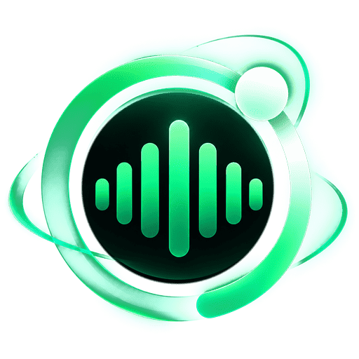
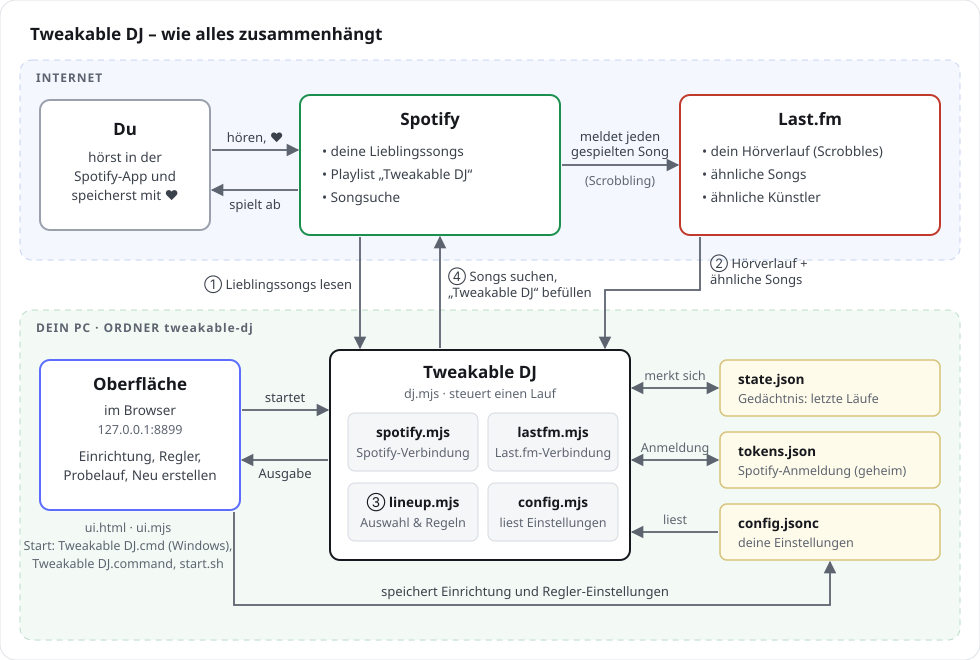

[English](README.md) · **Deutsch**

<p align="center"></p>

# Tweakable DJ for Spotify

**Dein persönlicher, einstellbarer DJ für Spotify – ohne Ansagen, mit mehr Abwechslung.**

Der KI-DJ von Spotify spricht zwischen den Songs, und seine Stimme lässt sich nicht abschalten. Tweakable DJ kommt ohne Ansagen aus: Er befüllt die Playlist **„Tweakable DJ“** mit einem Mix aus deinen Lieblingssongs und neuen Songs, die zu deinem Geschmack passen, am stärksten zu dem, was du gerade hörst.
Wie viel Abwechslung, wie viele Favoriten und wie oft derselbe Künstler vorkommt, stellst du selbst ein.
Die Oberfläche gibt es auf Deutsch und Englisch, außerdem auf Spanisch und Französisch (maschinell übersetzt – Korrekturen gern als [Issue](https://github.com/hayboeck/tweakable-dj-for-spotify/issues)); die Sprache wählst du oben rechts.

<p align="center">
  <picture>
    <source media="(prefers-color-scheme: dark)" srcset="docs/screenshot-playlist.dark.png">
    
  </picture>
</p>
<p align="center"><sub>Die Bilder in dieser Anleitung zeigen die englische Oberfläche; sie ist auch auf Deutsch verfügbar (Sprache oben rechts).</sub></p>

Tweakable DJ ist ein unabhängiges Projekt und kein offizielles Spotify-Produkt (mehr dazu in [Abschnitt 12](#12-datenquellen-marken-und-lizenz)).

> **Das brauchst du**
>
> - **Spotify Premium**. Tweakable DJ braucht eine eigene Spotify-App, und die erlaubt Spotify nur mit Premium.
> - Ein kostenloses **Last.fm-Konto**, das mit Spotify verbunden ist („Scrobbling“). Darüber kennt der DJ deinen Hörverlauf.
> - **Node.js 18 oder neuer** (kostenlos, <https://nodejs.org>)
> - Einen **PC oder Mac** mit Windows, macOS oder Linux. Tweakable DJ läuft dort, nicht im Internet.
> - Etwa **10 Minuten** für die [Einrichtung](#7-einrichtung-einmalig)
>
> Jede Person richtet Tweakable DJ mit ihrer **eigenen Spotify-App** ein. Spotify lässt pro App im Entwicklermodus höchstens 5 Nutzer zu. Deshalb ist Tweakable DJ kein Dienst zum Anmelden, sondern ein Werkzeug, das du bei dir selbst einrichtest.

**Inhalt**

1. [Schnellstart](#1-schnellstart)
2. [Wie alles zusammenhängt](#2-wie-alles-zusammenhängt)
3. [Was ist was im Ordner](#3-was-ist-was-im-ordner)
4. [So entsteht eine Playlist](#4-so-entsteht-eine-playlist)
5. [Regeln und Einstellungen](#5-regeln-und-einstellungen)
6. [Bedienung](#6-bedienung)
7. [Einrichtung (einmalig)](#7-einrichtung-einmalig)
8. [Aktualisieren](#8-aktualisieren)
9. [Deinstallieren](#9-deinstallieren)
10. [Probleme und Lösungen](#10-probleme-und-lösungen)
11. [Grenzen](#11-grenzen)
12. [Datenquellen, Marken und Lizenz](#12-datenquellen-marken-und-lizenz)

---

## 1. Schnellstart

Zum ersten Mal hier? Dann Tweakable DJ herunterladen, Node.js installieren und starten, wie in der [Einrichtung](#7-einrichtung-einmalig) beschrieben. Beim ersten Start führt dich ein Assistent durch den Rest (ca. 10 Minuten). Danach geht es jedes Mal so:

1. Tweakable DJ starten: Doppelklick auf **`Tweakable DJ.cmd`** (Windows) bzw. **`Tweakable DJ.command`** (Mac), unter Linux im Terminal `./start.sh`. Im Browser öffnet sich die Oberfläche mit Reglern.
2. Eine **Voreinstellung** wählen (z. B. „Entdecken“) oder die Regler selbst einstellen, dann auf **Probelauf** klicken. Der DJ zeigt, welche Songs er auswählen würde, und ändert nichts.
3. Passt die Auswahl, unter der Liste auf **Diese Liste übernehmen** klicken: Genau diese Songs kommen in dieser Reihenfolge nach „Tweakable DJ“. (**Playlist neu erstellen** lost dagegen neu aus und dauert etwa eine Minute.)
4. In Spotify „Tweakable DJ“ anhören, am besten ohne Zufallswiedergabe, weil der DJ die Reihenfolge schon gemischt hat.

Das Konsolen- bzw. Terminalfenster, das sich dabei öffnet, muss offen bleiben, solange du die Oberfläche benutzt.

---

## 2. Wie alles zusammenhängt



Die Nummern zeigen die Reihenfolge eines Laufs:
① Lieblingssongs von Spotify lesen → ② Hörverlauf und ähnliche Songs von Last.fm holen → ③ nach deinen Regeln auswählen → ④ Songs auf Spotify suchen und „Tweakable DJ“ befüllen.

- **Spotify** liefert deine Lieblingssongs und bekommt die fertige Playlist. Empfehlungen und verwandte Künstler gibt Spotify seit November 2024 nicht mehr an neu angelegte Apps heraus, und seit Februar 2026 bekommen Apps im Entwicklermodus auch die Top-Songs eines Künstlers nicht mehr. Deshalb kommen die Vorschläge von Last.fm.
- **Last.fm** liefert zu jedem Song ähnliche Songs und kennt deinen Hörverlauf. Dafür ist dein Spotify-Konto mit Last.fm verbunden („Scrobbling“), und jeder gespielte Song wird dort erfasst.
- **Tweakable DJ** läuft auf deinem PC, holt die Daten von beiden Diensten, wählt nach deinen Regeln aus und schreibt das Ergebnis in die Playlist.
- **Die Oberfläche** ist eine Webseite, die nur auf deinem PC läuft (<http://127.0.0.1:8899>). Sie führt durch die Einrichtung, ändert die Einstellungen und startet den DJ.

„Tweakable DJ“ ist immer **dieselbe Playlist mit demselben Link**. Jeder Lauf ersetzt nur ihren Inhalt.

---

## 3. Was ist was im Ordner

**Zum Benutzen**

| Datei | Wozu | Anfassen? |
|---|---|---|
| `Tweakable DJ.cmd` | Startet die Oberfläche per Doppelklick (Windows) | ja, zum Starten |
| `Tweakable DJ.command` | Startet die Oberfläche per Doppelklick (Mac) | ja, zum Starten |
| `start.sh` | Startet die Oberfläche unter Linux (im Terminal `./start.sh`). Der Mac benutzt sie mit. | ja, zum Starten |
| `config.jsonc` | Alle Einstellungen, jede mit einer Erklärung in derselben Zeile. Außerdem die Zugangsdaten. Wird bei der Einrichtung angelegt. | ja: über die Oberfläche oder direkt im Editor |
| `README.de.md` | Diese Anleitung | lesen |
| `README.md` | Diese Anleitung auf Englisch | lesen |
| `CHANGELOG.md` | Was sich in jeder Version geändert hat (Englisch und Deutsch) | lesen |

**Programm** (nur ändern, wenn du weißt, was du tust)

| Datei | Wozu |
|---|---|
| `dj.mjs` | Der DJ selbst: steuert einen Lauf von Anfang bis Ende (Schritte in Abschnitt 4) |
| `lineup.mjs` | Die Auswahl- und Reihenfolge-Regeln: Auslosung, „3 aus 20“, Abstand, Vergleich von Songtiteln |
| `trial.mjs` | Merkt sich den letzten Probelauf für *Diese Liste übernehmen* und prüft, ob er noch gilt |
| `playlist.mjs` | Schreibt und liest die Playlist; Format und Import der [Textdatei](#textdatei-speichern-und-importieren) |
| `archive.mjs` | Das [Playlist-Archiv](#playlist-archiv): legt jede geschriebene Playlist als Textdatei in `archiv/` ab und räumt alte auf |
| `spotify.mjs` | Verbindung zu Spotify: Anmeldung, Lieblingssongs lesen, Songs suchen, Playlist schreiben |
| `lastfm.mjs` | Verbindung zu Last.fm: ähnliche Songs und Künstler, dein Hörverlauf |
| `config.mjs` | Liest und schreibt die `config.jsonc`, ohne die Kommentare zu zerstören |
| `i18n.mjs` | Alle Meldungen von Programm und Server auf Deutsch, Englisch, Spanisch und Französisch (die Texte der Oberfläche stehen in `ui.html`) |
| `ui.mjs` | Kleiner Webserver für die Oberfläche; startet den DJ auf Knopfdruck |
| `ui.html` | Die Oberfläche selbst (Einrichtungs-Assistent, Regler, Buttons, Ausgabe), mit allen Texten auf Deutsch, Englisch, Spanisch und Französisch |
| `schedule.mjs` | Die Automatik: trägt Tweakable DJ in den Zeitplaner deines Systems ein (Windows-Aufgabenplanung, macOS launchd, Linux cron) und liest den Stand aus |
| `shortcut.mjs` | Die [Verknüpfung auf dem Desktop](#verknüpfung-auf-dem-desktop) mit dem Logo als Symbol: legt sie an, prüft und entfernt sie (Windows: `.lnk`, Mac: ein kleines `.app`, Linux: `.desktop`-Datei) |
| `notify.mjs` | Systembenachrichtigung, wenn ein automatischer Lauf fehlschlägt – nur mit Bordmitteln deines Systems (Windows: PowerShell, Mac: `osascript`, Linux: `notify-send`) |
| `update.mjs` | Prüft höchstens einmal am Tag, ob es auf GitHub eine neue Version gibt (siehe [Prüfung auf neue Versionen](#prüfung-auf-neue-versionen)) |
| `install-update.mjs` | Installiert eine neue Version, wenn du auf *Jetzt aktualisieren* klickst (siehe [Aktualisieren](#8-aktualisieren)) |
| `manifest.json` | Liste aller Programmdateien dieser Version mit Prüfsummen. *Jetzt aktualisieren* ersetzt nur Dateien, die dort stehen. Nur in der ZIP-Datei, nicht im GitHub-Repository. |
| `package.json` | Kurzbefehle für Entwickler: `npm start` (Oberfläche) und `npm test` (Tests). Tweakable DJ braucht keine zusätzlichen Pakete. |
| `tests/` | Automatische Tests für die Regeln, die Einstellungen, die Übersetzungen, die Automatik, die Verknüpfung auf dem Desktop (nur in Testordnern), die Prüfung auf neue Versionen und *Jetzt aktualisieren*, die Oberfläche, die Textdatei und Probeläufe samt Übernehmen, bei denen Spotify, Last.fm und GitHub nur simuliert werden. Nur im GitHub-Repository, nicht in der ZIP-Datei. |
| `config.example.de.jsonc` | Leere Vorlage der Einstellungen mit deutschen Erklärungen. Daraus wird bei der Einrichtung auf Deutsch deine `config.jsonc`. |
| `config.example.jsonc` | Dieselbe Vorlage mit englischen Erklärungen (für die Einrichtung auf Englisch, Spanisch oder Französisch) |
| `overview.de.svg`, `overview.en.svg` | Die Grafik in Abschnitt 2, auf Deutsch und Englisch |
| `docs/` | Bildschirmfotos der Oberfläche für diese Anleitung (englische Oberfläche), hell und dunkel |
| `assets/` | Das Logo: `logo.png` (Oberfläche und diese Anleitung), `logo-small.svg` (Browser-Tab), `logo.ico` und `logo.icns` (Symbol der Verknüpfung auf dem Desktop unter Windows und auf dem Mac) |
| `LICENSE` | Die Lizenz (MIT), siehe Abschnitt 12 |
| `.gitignore` | Sorgt dafür, dass `config.jsonc`, `tokens.json`, `state.json`, `lastfm-cache.json`, `probelauf.json`, die Dateien der Automatik, das Ergebnis der Prüfung auf neue Versionen, `.update/` und das Archiv `archiv/` nie mit hochgeladen werden |
| `.gitattributes` | Einheitliche Zeilenenden für Windows, Mac und Linux; kennzeichnet Bilder als binär. Nur im GitHub-Repository, nicht in der ZIP-Datei. |
| `.github/` | Vorlagen für Fehlermeldungen und Ideen, automatische Abläufe auf GitHub (z. B. die ZIP-Datei für neue Versionen). Nur im GitHub-Repository, nicht in der ZIP-Datei. |

**Automatisch angelegt** (nicht bearbeiten)

| Datei | Wozu |
|---|---|
| `tokens.json` | Deine Spotify-Anmeldung und wann du dich angemeldet hast. **Nicht weitergeben**, damit hätte jemand Zugriff auf deine Playlists. |
| `state.json` | Gedächtnis des DJ: welche Songs in den letzten Läufen drin waren, und welche Spotify-Suchen schon erledigt sind. Löschen setzt beides zurück. Das schadet nicht, der nächste Lauf dauert dann nur etwas länger. |
| `lastfm-cache.json` | Zwischengespeicherte Antworten von Last.fm (ähnliche Songs und Künstler), jeweils 7 Tage gültig. Macht Läufe schneller. Löschen schadet nicht. |
| `probelauf.json` | Ergebnis des letzten Probelaufs (Songs, Zeitpunkt, Fingerabdruck der Einstellungen) für *Diese Liste übernehmen* bzw. `node dj.mjs --apply`. Ein echter Lauf und das Übernehmen löschen sie. Löschen schadet nicht. |
| `automatik.json` | Ergebnis des letzten automatischen Laufs (Zeit, ✓ oder Fehlergrund). Die Oberfläche zeigt es unter *Automatisch neu erstellen* (Tab *Einstellungen*) an. |
| `automatik.log` | Die komplette Ausgabe des letzten automatischen Laufs, für die Fehlersuche |
| `update-check.json` | Ergebnis der letzten [Prüfung auf neue Versionen](#prüfung-auf-neue-versionen) (Zeit und neueste Version). Löschen schadet nicht. |
| `.update/` | Legt *Jetzt aktualisieren* an: die Sicherung der Programmdateien der vorigen Version (`backup-<Version>`). Löschen schadet nicht. |
| `archiv/` | Das [Playlist-Archiv](#playlist-archiv): jede geschriebene Playlist als Textdatei, z. B. `2026-10-06 18-30-05 Tweakable DJ.txt`. Löschen schadet nicht, die früheren Playlists sind dann nur weg. |

`config.jsonc` enthält deine Client ID und deinen Last.fm-Schlüssel. Beides ist nicht sehr heikel, sollte aber trotzdem nicht öffentlich geteilt werden.

---

## 4. So entsteht eine Playlist

Die Zahlen sind die Standardwerte. Deine eigenen stehen in `config.jsonc` bzw. in der Oberfläche. „Lieblingssongs“ steht für die Quelle deiner Favoriten: Hast du dort eine deiner Playlists gewählt, tritt sie an ihre Stelle.

```
Lieblingssongs ──┐
Last.fm-Top-Songs┼─► 20 Ausgangspunkte ─► ~150–200 Kandidaten ─► neue Songs + Favoriten ─► Reihenfolge ─► „Tweakable DJ“
Aktuell gehört ──┘        (Los)               (Last.fm)              (Los + Regeln)           (Regeln)
```

1. **Ausschlüsse festlegen:** Was du in den letzten 14 Tagen gehört hast, was in den letzten 3 Läufen schon drin war, alles von Künstlern auf deiner Sperrliste und die Songs darauf (in jeder Version) kommen nicht hinein – und explizite Songs, wenn du *Keine Songs mit expliziten Texten* eingeschaltet hast.
2. **Ausgangspunkte ziehen:** Aus deinen Lieblingssongs, deinen Last.fm-Top-Songs und dem, was du gerade hörst, werden 20 Songs gezogen. Hast du einen Song oder dessen Künstler gerade gehört, hat er ein 3× größeres Los.
3. **Kandidaten sammeln:** Last.fm liefert zu jedem Ausgangspunkt die 30 ähnlichsten Songs. Manchmal macht der DJ zusätzlich einen Abstecher zu einem verwandten Künstler, der etwas weiter weg ist. Bekannte Lieblingssongs und ausgeschlossene Songs fliegen raus. Antworten von Last.fm merkt sich der DJ 7 Tage lang, dann geht der nächste Lauf schneller.
4. **Favoriten auswählen:** 15 % der Playlist kommen aus deinen Lieblingssongs. Künstler, die du gerade hörst, werden bevorzugt (und Künstler, denen du auf Spotify folgst, wenn du *Gefolgte Künstler* so eingestellt hast).
5. **Neue Songs auslosen:** Die Kandidaten kommen in eine Lostrommel. Wie stark ähnliche Songs bevorzugt werden, bestimmt „Abenteuer“, wie stark aktuelles Hören zählt, bestimmt der Faktor, wie stark Künstler zählen, denen du folgst, bestimmt „Gefolgte Künstler“, und ob neuere oder ältere Songs bevorzugt werden, „Neuere / ältere Songs“. Jeder gezogene Song muss durch die Künstler-Limits und wird auf Spotify gesucht. Nur wenn Titel und Interpret passen, kommt er hinein.
6. **Reihenfolge festlegen:** Der DJ probiert bis zu 200 Reihenfolgen durch und nimmt die, die die Regeln am besten einhält.
7. **Playlist befüllen:** Der Inhalt von „Tweakable DJ“ wird ersetzt, und die neuen Songs werden als „schon gespielt“ gemerkt.

Zufall spielt in den Schritten 2 bis 6 mit, deshalb sieht jeder Lauf anders aus.

Songs, die du aus „Tweakable DJ“ mit dem Herz speicherst, werden zu neuen Lieblingssongs und damit ab dem nächsten Lauf auch zu Ausgangspunkten.

---

## 5. Regeln und Einstellungen

Jede Regel lässt sich in `config.jsonc` oder in der Oberfläche ändern. Der Name der Einstellung steht in Klammern. „Standard“ ist der Wert, den der DJ ohne eigene Einstellung verwendet.

„Erlaubt“ ist, was `config.jsonc` annimmt; Anzahlen, Tage und Läufe sind ganze Zahlen. Die Regler der Oberfläche decken den üblichen Bereich ab. Einen größeren Wert aus `config.jsonc` zeigen sie trotzdem richtig an und lassen ihn, wie er ist. Liegt ein Wert außerhalb des erlaubten Bereichs, markiert ihn die Oberfläche rot, und ein Lauf bricht mit einer Meldung ab, z. B. „size in config.jsonc muss eine ganze Zahl von 1 bis 500 sein (derzeit 0).“

**Was in die Playlist kommt**

| Regel | Standard | Erlaubt |
|---|---|---|
| Name der Playlist (`playlistName`). Gibt es sie nicht, wird sie angelegt. | Tweakable DJ | beliebiger Name |
| Quelle deiner Favoriten (`seed`): deine Lieblingssongs (`"liked"`) oder eine eigene bzw. gemeinsame Playlist. Daraus kommen die Favoriten und die meisten Ausgangspunkte. | Lieblingssongs | `"liked"` oder Link zu einer Playlist |
| Länge der Playlist (`size`) | 50 Songs | 1–500 |
| Anteil Favoriten (`familiarShare`). Der Rest sind neue Songs, die nicht in der Quelle deiner Favoriten sind. | 15 % (≈ 8 Songs) | 0–1 (`0.15` = 15 %) |
| Abenteuer (`adventure`): 0 = ähnliche Songs bevorzugen, 0,5 = egal, 1 = entfernte Songs bevorzugen. Bestimmt auch, bei wie vielen Ausgangspunkten der DJ zu verwandten Künstlern abschweift. | 0,4 | 0–1 |
| Ausgangspunkte pro Lauf (`seedsPerRun`) | 20 | 1–200 |
| Last.fm-Top-Songs der letzten 3 Monate zusätzlich als Ausgangspunkte (`useLastfmTopTracks`) | an | `true` oder `false` |
| Gefolgte Künstler (`followedArtists`): Künstler, denen du auf Spotify folgst. -1 = keine davon (wie die Sperrliste, auch als Gast über „feat.“), unter 0 = seltener, 0 = egal (die Liste wird gar nicht abgefragt), über 0 = öfter, 1 = stark bevorzugt, aber nicht ausschließlich. Gilt für neue Songs und Favoriten, nicht für die Ausgangspunkte. | 0 (egal) | -1–1 |
| Neuere / ältere Songs (`preferNewer`): nach dem Erscheinungsjahr laut Spotify. Unter 0 = ältere Songs bevorzugen, 0 = egal, über 0 = neuere bevorzugen. Nur ein Gewicht bei der Auslosung, es fällt nichts weg. Gilt für neue Songs und Favoriten, nicht für die Ausgangspunkte. | 0 (egal) | -1–1 |

So wirkt *Gefolgte Künstler*: Ein Song eines Künstlers, dem du folgst, bekommt bei der Auslosung einen Faktor von 10 hoch Einstellung, also 0,5 = 3,2× so großes Los, 1 = 10× so großes Los, -0,5 = ⅓ so großes Los; bei -1 fallen solche Songs ganz weg. Der Faktor wird mit den übrigen Gewichten (Abenteuer, Faktor für aktuelles Hören) multipliziert, und die Grenzen pro Künstler gelten weiter, deshalb besteht die Playlist nie nur aus gefolgten Künstlern. Namen werden wie überall verglichen (Groß-/Kleinschreibung, Akzente und ein „The“ am Anfang sind egal), es zählen aber nur ganze Namen: Wer „Queen“ folgt, bekommt nicht „Queen Latifah“. Hast du dich bei Spotify angemeldet, bevor es diese Einstellung gab, melde dich einmal neu an (die Oberfläche zeigt dazu einen Hinweis). Bis dahin zeigt ein Lauf eine Warnung und macht weiter, als stünde die Einstellung auf 0.

So wirkt *Neuere / ältere Songs*: Jeder Song bekommt eine Neuheit von +1 (erschienen in diesem Jahr) über 0 (vor 10 Jahren) bis -1 (vor 20 Jahren oder früher). Sein Los wird mit 4 hoch (Einstellung × Neuheit) multipliziert: Bei 1 hat ein Song von diesem Jahr ein 4× so großes Los, einer von vor 20 Jahren ein 4× kleineres; bei 0,5 jeweils 2×, bei -1 umgekehrt. Ohne bekanntes Erscheinungsjahr zählt ein Song neutral. Bei neuen Songs kennt der DJ das Jahr erst, wenn er sie einmal auf Spotify gesucht hat (Such-Cache in `state.json`); bei der ersten Suche wirkt ein kleineres Los deshalb als Wahrscheinlichkeit, mit der er den Song nimmt. Songs, die eine ältere Version gesucht hat, haben kein Jahr im Cache und zählen neutral – nur deswegen wird nicht neu gesucht.

**Was du gerade hörst, zählt mehr**

| Regel | Standard | Erlaubt |
|---|---|---|
| „Aktuell“ ist alles, was du laut Last.fm in diesem Zeitraum gehört hast (`currentDays`). 0 = aus. | 7 Tage | 0–365 |
| Faktor für aktuelles Hören (`currentFactor`), 1 = aus. Bei Faktor 3 gilt Folgendes: | 3 | 1–100 |
| – Ein Ausgangspunkt wird 3× so oft gezogen, wenn du den Song oder seinen Künstler gerade hörst. Die aktuell gehörten Songs selbst sind ebenfalls Ausgangspunkte. | | |
| – Ein neuer Song, der über so einen Ausgangspunkt gefunden wurde, hat bei der Auslosung ein 3× so großes Los. | | |
| – Favoriten von Künstlern, die du gerade hörst, werden 3× so oft gewählt. | | |

In der Ausgabe sind solche Songs mit „· aktuell“ markiert (auf Englisch „· current“).

**Was nicht in die Playlist kommt**

| Regel | Standard | Erlaubt |
|---|---|---|
| Kürzlich gehört (`excludeRecentDays`): alles, was du laut Last.fm in diesem Zeitraum gehört hast. 0 = aus. | 14 Tage | 0–365 |
| Vorige Läufe (`noRepeatRuns`): Songs aus den letzten N Läufen. 0 = aus. | 3 Läufe | 0–100 |
| Sperrliste (`blockedArtists`): Künstler, die nie vorkommen, weder als Song noch als Ausgangspunkt noch als Abstecher. Es zählen ganze Wörter: „Macloud“ sperrt auch „Miksu / Macloud“ und „feat. Macloud“, aber „Rin“ sperrt nicht „Karin“. | keine | Liste von Namen |
| Gesperrte Songs (`blockedTracks`): einzelne Songs, die nie vorkommen, weder als Favorit noch als neuer Song noch als Ausgangspunkt. Als derselbe Song gilt, was denselben Link zu Spotify oder denselben Künstler und Titel hat, Zusätze wie „Remastered 2011“, „(Live)“ oder „feat.“ nicht mitgezählt – andere Versionen sind also mitgesperrt. Am einfachsten mit × in der Liste eines Probelaufs ([Sperrliste](#sperrliste-künstler-und-songs)). | keine | höchstens 1 000 Einträge `{ "uri": "spotify:track:…", "artist": "…", "name": "…" }` (`uri` darf fehlen) |
| Keine Songs mit expliziten Texten (`excludeExplicit`): Songs, die Spotify als explizit kennzeichnet, kommen nicht hinein – weder als Favorit noch als neuer Song noch beim Auffüllen mit Favoriten. Hat Spotify von einem neuen Song eine nicht explizite Version, nimmt der DJ diese. Ausgangspunkte bleiben, sie bestimmen nur, wonach Last.fm sucht. | aus | `true` oder `false` |
| Songs, die auf Spotify nicht eindeutig gefunden werden (Titel und Interpret müssen passen). Zusätze wie „Remastered“ oder „feat.“ werden beim Vergleich ignoriert. | immer | |

**Wie oft derselbe Künstler vorkommt**

In der Oberfläche setzt ein einziger Regler **Abwechslung bei Künstlern** die vier Regeln darunter zusammen. *Mittel* ist der Standard, wer ihn nie anfasst, merkt also keinen Unterschied:

| Stufe | Songs pro Interpret | Derselbe Künstler in aufeinanderfolgenden Songs | Abstand gleicher Interpret |
|---|---|---|---|
| wenig | höchstens 4 | höchstens 4 aus 15 | mind. 2 Songs |
| mittel (Standard) | höchstens 2 | höchstens 3 aus 20 | mind. 4 Songs |
| viel (= Voreinstellung *Entdecken*) | höchstens 2 | höchstens 2 aus 20 | mind. 4 Songs |
| sehr viel | 1 | höchstens 2 aus 20 | mind. 8 Songs |

Jede Stufe klappt mit 50 Songs und einer üblichen Bibliothek. Hat die Quelle deiner Favoriten nur wenige Künstler, findet „sehr viel“ eventuell weniger Songs oder verletzt eine Regel; dann zeigt der DJ eine Warnung (⚠). Passen deine vier Werte zu keiner Stufe (z. B. von Hand in `config.jsonc` geändert), zeigt der Regler *Eigene Einstellung*. Ziehst du ihn, werden alle vier überschrieben; *Verwerfen* holt die gespeicherten zurück.

**Für Fortgeschrittene:** die vier Einzelwerte. In der Oberfläche stehen sie unter *Details für Fortgeschrittene*, in `config.jsonc` bleiben sie, wie sie sind.

| Regel | Standard | Erlaubt |
|---|---|---|
| Pro Interpret höchstens N Songs in der ganzen Playlist (`maxPerArtist`) | 2 | 1–500 |
| In jeweils 20 aufeinanderfolgenden Songs höchstens 3 Songs zum selben Künstler (`artistWindow`, `maxPerWindow`). Mitgezählt werden Songs *von* ihm und neue Songs, die *über* ihn gefunden wurden (z. B. „neu, über Künstler X“). Bei 50 Songs sind das höchstens 8 pro Künstler. | 3 aus 20 | je 1–100 |
| Abstand zwischen zwei Songs desselben Interpreten (`artistGap`). 0 = aus. | mind. 4 Songs dazwischen | 0–50 |

**Wenn nicht alles gleichzeitig geht**

- Findet der DJ zu wenige neue Songs, füllt er mit weiteren Favoriten auf. Dabei können auch Favoriten dazukommen, die du kürzlich gehört hast oder die in den letzten Läufen drin waren.
- Bei der Reihenfolge hat „3 aus 20“ Vorrang vor dem Mindestabstand.
- Wird eine Regel trotzdem verletzt, zeigt der DJ eine Warnung (⚠).

**Automatik**

Den Zeitplan selbst (`schedule`, `scheduleTime`, `scheduleDay`) stellst du am einfachsten in der Oberfläche ein, siehe [Bedienung](#mit-der-oberfläche).

| Einstellung | Standard | Erlaubt |
|---|---|---|
| Bei Fehlern benachrichtigen (`notifyOnFailure`): Schlägt ein automatischer Lauf fehl, zeigt dein System eine Benachrichtigung mit dem Grund und was zu tun ist (z. B. „Die Spotify-Anmeldung ist abgelaufen. Öffne Tweakable DJ und melde dich neu bei Spotify an.“). Ab 10 Tagen bevor die Spotify-Anmeldung abläuft, erinnert auch ein erfolgreicher automatischer Lauf daran, höchstens einmal am Tag. Läufe aus der Oberfläche oder dem Terminal melden sich nie. | an | `true` oder `false` |

**Archiv**

| Einstellung | Standard | Erlaubt |
|---|---|---|
| Archivierte Playlists (`archiveCount`): Nach jedem Schreiben der Playlist kommt sie als Textdatei in den Ordner `archiv`; so viele der neuesten bleiben, ältere löscht Tweakable DJ selbst. 0 = aus: Es wird nichts gespeichert, vorhandene Dateien bleiben. Siehe [Playlist-Archiv](#playlist-archiv). | 20 | 0–200 |

**Aussehen**

| Einstellung | Standard | Erlaubt |
|---|---|---|
| Modus der Oberfläche (`theme`): `"system"` richtet sich nach deinem Gerät, `"light"` = immer hell, `"dark"` = immer dunkel | `"system"` | `"system"`, `"light"`, `"dark"` |
| Akzentfarbe der Oberfläche (`accent`): Farbe von Links, Reglern und Buttons | `"green"` | `"green"`, `"blue"`, `"violet"`, `"pink"`, `"red"`, `"orange"`, `"gold"`, `"teal"` |

Beide ändern nur die Oberfläche, nicht die Playlist; ein Probelauf bleibt deshalb übernehmbar.

**Sprache**

| Einstellung | Standard |
|---|---|
| Sprache der Oberfläche und der Ausgabe (`language`): `"de"` = Deutsch, `"en"` = Englisch, `"es"` = Spanisch, `"fr"` = Französisch, `""` = noch nicht gewählt. Gilt auch für automatische Läufe und das Terminal. | `""`: die Sprache des Browsers (Oberfläche) bzw. des Systems (Terminal, Automatik) |

---

## 6. Bedienung

### Mit der Oberfläche

Doppelklick auf `Tweakable DJ.cmd` (Windows) bzw. `Tweakable DJ.command` (Mac), unter Linux im Terminal `./start.sh`. Überall geht auch `node ui.mjs` im Terminal. Der Browser öffnet <http://127.0.0.1:8899>.
Beim allerersten Start fragt das System eventuell nach, siehe [Einrichtung](#7-einrichtung-einmalig), Schritt 3. Ist Tweakable DJ noch nicht eingerichtet, erscheint statt der Regler der Einrichtungs-Assistent.

Die Seite hat zwei Tabs: **Playlist** (Voreinstellungen, Regler, Ausgabe mit Textdatei und Probelauf) und **Einstellungen** (Automatik, Sperrliste, Archiv, Aussehen, Zugangsdaten, Verknüpfung, Version).

- **Sprache** (oben rechts, ein kleines Auswahlfeld, z. B. **DE ▾**, mit Deutsch, English, Español und Français): schaltet die ganze Oberfläche sofort um, auch im Assistenten. Die Wahl wird in `config.jsonc` gespeichert (`language`) und gilt dann auch für Probelauf, Neuerstellung, automatische Läufe und das Terminal. Solange du nichts wählst, richtet sich die Oberfläche nach der Sprache deines Browsers. Spanisch und Französisch sind maschinell übersetzt; eine Zeile ganz unten auf der Seite weist darauf hin und verlinkt die [Issues](https://github.com/hayboeck/tweakable-dj-for-spotify/issues), wo Korrekturen willkommen sind.
- **Voreinstellungen**: Vier Buttons setzen alle Regel-Regler auf einmal:
  - *Entdecken*: viel Neues, auch weiter weg von deinem Geschmack
  - *Vertraut*: mehr Favoriten und sehr ähnliche Songs
  - *Meine aktuelle Phase*: richtet sich stark nach dem, was du gerade hörst
  - *Standard*: die Grundeinstellungen

  Name, Quelle, Anzahl Songs, gefolgte Künstler, *Neuere / ältere Songs* und Sperrliste bleiben dabei, wie sie sind. Passt deine Einstellung genau zu einer Voreinstellung, ist diese markiert.
- **Regler**: Jede Einstellung hat einen Regler, eine Erklärung und einen grünen Hinweis, was der Wert gerade bewirkt. Weicht ein Wert vom Standard ab, bringt „Standard: …“ ihn per Klick zurück. Einen Wert aus `config.jsonc` außerhalb des erlaubten Bereichs markiert die Oberfläche rot ([Regeln und Einstellungen](#5-regeln-und-einstellungen)).
- **Abwechslung bei Künstlern**: Ein Regler mit vier Stufen (*wenig* bis *sehr viel*) setzt alle vier Künstler-Regeln auf einmal. Die Einzelwerte stehen unter *Details für Fortgeschrittene*; passen sie zu keiner Stufe, zeigt der Regler *Eigene Einstellung*, und die Details sind aufgeklappt.
- **Quelle deiner Favoriten**: Auswahlliste mit deinen Lieblingssongs und deinen Playlists. Zur Auswahl stehen nur Playlists, die dir gehören oder bei denen du mitarbeitest, weil Spotify nur deren Inhalt herausgibt.
- **Sperrliste** (Tab *Einstellungen*): Künstler, einzelne Songs und explizite Songs, siehe [Sperrliste](#sperrliste-künstler-und-songs) weiter unten.
- **Archiv** (Tab *Einstellungen*): wie viele frühere Playlists als Textdatei aufgehoben werden, siehe [Playlist-Archiv](#playlist-archiv).
- **Aussehen** (Tab *Einstellungen*): *Modus* (*System*, *Hell*, *Dunkel*; *System* folgt der Einstellung deines Geräts) und eine von 8 *Akzentfarben* als runde Farbfelder (Standard: Grün, das Grün des Spotify-Logos). Eine Änderung siehst du sofort; *Speichern* behält sie, *Verwerfen* holt die bisherige zurück. Damit beim Öffnen nichts aufblitzt, merkt sich der Browser zusätzlich die gespeicherte Wahl.
- **Speichern / Verwerfen**: Änderungen werden erst mit *Speichern* in `config.jsonc` geschrieben. Beides gilt für beide Tabs; ein Punkt am anderen Tab zeigt dort ungespeicherte Änderungen. Im Tab *Einstellungen* gibt es nur diese zwei Buttons.
- **Probelauf**: Zeigt die Auswahl an, ohne die Playlist zu ändern. Darunter:
  - **Diese Liste übernehmen**: schreibt genau diese Songs in dieser Reihenfolge in „Tweakable DJ“, ohne neu zu losen, samt Beschreibung. Das zählt wie ein Lauf (die Songs sind danach für *Vorige Läufe sperren* gemerkt). Der Button gilt 24 Stunden und nur, solange die Einstellungen so bleiben wie beim Probelauf; danach, nach einer Neuerstellung (auch durch die Automatik) oder wenn `probelauf.json` fehlt, ist er gesperrt und sagt, warum. Dann einfach einen neuen Probelauf starten. Zurückgestellte Regler machen ihn wieder frei.
  - **Als Textdatei speichern** (unter der Ausgabe): lädt nach einem Probelauf dessen Liste herunter, auch wenn sie (noch) nicht in der Playlist steht; der Dateiname endet auf `-probelauf`.
  - **♥ hinter jedem Song** (neben dem × zum Sperren): fügt den Song in Spotify zu deinen Lieblingssongs hinzu. Ein gefülltes ♥ heißt, er ist schon einer; ein weiterer Klick entfernt ihn wieder. Dafür braucht es die Berechtigung `user-library-modify`: Hast du dich bei Spotify angemeldet, bevor es sie gab (Version 0.2.4 oder älter), bittet die Oberfläche dich, dich einmal neu anzumelden – alles andere funktioniert weiter.
- **Playlist neu erstellen**: Lost neu aus, befüllt „Tweakable DJ“ und zeigt danach einen Link zu Spotify. Die Beschreibung der Playlist nennt Zeitpunkt sowie Anzahl neuer Songs und Favoriten; die Spieldauer zeigt Spotify selbst an.
- **Ausgabe**: immer sichtbar, vor dem ersten Lauf mit einem kurzen Platzhalter. Darunter stehen die Buttons für die Textdatei: *Als Textdatei speichern* lädt „Tweakable DJ“ so herunter, wie die Playlist gerade in Spotify ist (nach einem Probelauf: dessen Liste, siehe oben). *Importieren … → Aus Datei …* füllt sie mit einer eigenen Liste: erst eine Vorschau („38 von 40 gefunden“ und die Zeilen, die nicht passen), dann *In Playlist „Tweakable DJ“ schreiben (ersetzt den Inhalt)*. Mehr unter [Textdatei](#textdatei-speichern-und-importieren). *Importieren … → Frühere Playlist …* holt eine Playlist aus dem [Archiv](#playlist-archiv) zurück, mit derselben Vorschau und Rückfrage.
- **Zugangsdaten** (Tab *Einstellungen*): zeigt, ob du bei Spotify angemeldet bist, und deinen Last.fm-Benutzernamen. **Zugangsdaten ändern** öffnet den Einrichtungs-Assistenten mit deinen bisherigen Angaben.
- <a id="verknüpfung-auf-dem-desktop"></a>**Verknüpfung** (Tab *Einstellungen*): zeigt, ob es auf deinem Desktop eine Verknüpfung *Tweakable DJ* mit dem Logo gibt. **Verknüpfung anlegen** legt eine an, die Tweakable DJ per Doppelklick startet (Windows: `Tweakable DJ.lnk`, Mac: `Tweakable DJ.app`, Linux: `tweakable-dj.desktop`). Hast du den Ordner verschoben, steht dort *Zeigt auf einen anderen Ordner*; **Neu anlegen** behebt das. **Entfernen** löscht sie. Tweakable DJ fasst nur die eigene Verknüpfung an: Liegt auf dem Desktop etwas anderes unter diesem Namen, bleibt es, wie es ist.
- **Mit Spotify anmelden**: Erscheint, wenn die Spotify-Anmeldung bald abläuft oder abgelaufen ist. Spotify verlangt alle 6 Monate eine neue Anmeldung. Außerdem, wenn *Gefolgte Künstler* nicht auf „egal“ steht und deine Anmeldung älter ist als diese Einstellung.
- **Automatisch neu erstellen** (Tab *Einstellungen*): *Aus*, *Täglich* oder *Wöchentlich*, dazu Uhrzeit und gegebenenfalls Wochentag. Beim *Speichern* trägt sich Tweakable DJ in den Zeitplaner deines Systems ein und erstellt die Playlist dann von selbst neu, auch wenn die Oberfläche geschlossen ist. Darunter stehen der nächste Lauf und das Ergebnis des letzten automatischen Laufs (✓ mit Anzahl Songs oder ✗ mit Grund). Was passiert, wenn der Rechner zur eingestellten Zeit aus ist:
  - Windows: Der Lauf wird beim nächsten Einschalten nachgeholt.
  - Mac: Der Lauf wird nach dem Aufwachen aus dem Ruhezustand nachgeholt, nach dem Ausschalten nicht.
  - Linux: Der Lauf entfällt.

  **Bei Fehlern benachrichtigen** (standardmäßig an, sichtbar, solange die Automatik an ist): Schlägt ein automatischer Lauf fehl – Spotify-Anmeldung abgelaufen, Last.fm-Key ungültig oder gesperrt, kein Internet, Einrichtung oder `config.jsonc` kaputt –, zeigt dein System eine Benachrichtigung: „Tweakable DJ: automatischer Lauf fehlgeschlagen“, dazu der Grund und was zu tun ist. Ab 10 Tagen bevor die Spotify-Anmeldung abläuft, erinnert sie außerdem an die neue Anmeldung (höchstens einmal am Tag). **Testbenachrichtigung senden** zeigt sofort eine an, damit du siehst, ob Benachrichtigungen ankommen; das Ergebnis steht neben dem Button. Tweakable DJ nutzt nur Bordmittel deines Systems:
  - Windows: eine Benachrichtigung von *Windows PowerShell* (so heißt der Absender). Kommt keine, prüfe *Nicht stören* und *Einstellungen › System › Benachrichtigungen › Windows PowerShell*.
  - Mac: eine Benachrichtigung vom *Skripteditor* (`osascript`). Beim ersten Mal fragt macOS eventuell, ob er Mitteilungen zeigen darf.
  - Linux: `notify-send` (Paket `libnotify-bin` bzw. `libnotify`). Ohne das Paket oder ohne Desktop-Sitzung gibt es einfach keine Benachrichtigung.

  Lässt sich eine Benachrichtigung nicht anzeigen, zählt der Lauf trotzdem wie sonst; in `automatik.log` steht dann ein kurzer Hinweis, warum.
- **Neue Version**: Gibt es eine neuere Version von Tweakable DJ, erscheint oben ein Hinweis mit Link zum Download und der Schaltfläche **Jetzt aktualisieren** (siehe [Aktualisieren](#8-aktualisieren)). Mit × blendest du ihn aus; er kommt erst bei der nächsten Version wieder. Im Tab *Einstellungen* steht unter *Version*, welche Version du hast (z. B. *v0.1.3*), daneben **Nach Updates suchen**: Das fragt sofort bei GitHub nach und meldet dann *Du hast die neueste Version ✓*, zeigt den Hinweis wieder an (auch wenn du ihn ausgeblendet hattest) oder sagt *GitHub nicht erreichbar*. Mehr unter [Prüfung auf neue Versionen](#prüfung-auf-neue-versionen).

*Probelauf* und *Playlist neu erstellen* speichern vorher automatisch. Die Oberfläche ist nur auf deinem PC erreichbar, andere Geräte im Netzwerk und fremde Webseiten haben keinen Zugriff.

<p align="center">
  <picture>
    <source media="(prefers-color-scheme: dark)" srcset="docs/screenshot-settings.dark.png">
    
  </picture>
</p>

### Sperrliste: Künstler und Songs

Die Gruppe *Sperrliste* (Tab *Einstellungen*) hat drei Teile. Wie bei jeder Einstellung kommen Änderungen erst mit *Speichern* in die `config.jsonc` (ein Probelauf speichert vorher von selbst).

- **Keine Songs mit expliziten Texten**: ein Schalter. Ist er an, kommt kein Song in die Playlist, den Spotify als explizit kennzeichnet ([Regeln und Einstellungen](#5-regeln-und-einstellungen)). Ein Probelauf zeigt dann z. B. „4 explizite Songs ausgelassen“.
- **Künstler, die nie gespielt werden**: Namen eintragen und auf *Hinzufügen* klicken. Mit × wieder entfernen.
- **Songs, die nie gespielt werden**: Nach einem Probelauf steht hinter jedem Song der Liste ein kleines **×**. Ein Klick sperrt den Song: Er wird durchgestrichen, erscheint als Chip unter *Songs, die nie gespielt werden* und kommt ab dann bei keinem Lauf mehr vor, auch nicht in anderen Versionen (Remaster, Live, Single mit eigenem Link). **↺** neben einem durchgestrichenen Song oder × am Chip hebt die Sperre wieder auf. Ein Probelauf zeigt z. B. „2 gesperrte Songs ausgelassen“.

Sperrst du einen Song aus der Liste eines Probelaufs, ist *Diese Liste übernehmen* gesperrt (die Liste enthält ja den Song). Starte einen neuen Probelauf; er speichert deine Änderungen vorher.

Für einen Import aus einer Textdatei gilt die Sperrliste nicht: Es ist deine Liste. Die Vorschau nennt die Songs, die ein Lauf des DJ auslassen würde („auf deiner Sperrliste“, „explizit“), und sie kommen trotzdem hinein.

### Im Terminal

Im Ordner `tweakable-dj` ([so öffnest du dort ein Terminal](#terminal-im-ordner-öffnen)):

```
node dj.mjs          # Playlist neu befüllen
node dj.mjs --dry    # Probelauf: nur anzeigen, Playlist nicht ändern (merkt sich die Liste in probelauf.json)
node dj.mjs --apply  # den letzten Probelauf genau so in die Playlist schreiben, ohne neu zu losen (mit --dry nur prüfen)
node dj.mjs export [datei.txt]   # Playlist als Textdatei speichern (ohne Angabe: tweakable-dj-<Datum>.txt)
node dj.mjs import <datei.txt>   # Songs aus einer Textdatei in die Playlist schreiben (mit --dry nur anzeigen)
node dj.mjs login    # bei Spotify (neu) anmelden
node dj.mjs --auto   # wie ein automatischer Lauf: schreibt zusätzlich automatik.log und automatik.json
node ui.mjs          # Oberfläche starten (auch: npm start)
node ui.mjs --no-browser   # dasselbe, ohne den Browser zu öffnen
npm test             # automatische Tests; Spotify, Last.fm und GitHub werden dabei nur simuliert
```

Die Ausgabe kommt in der Sprache aus `config.jsonc` (`language`), sonst in der Sprache des Systems. Drei Umgebungsvariablen helfen in Sonderfällen:

| Variable | Wirkung |
|---|---|
| `TWEAKABLE_DJ_LANG` | `de`, `en`, `es` oder `fr`: Sprache der Ausgabe für diesen Aufruf, geht vor `language` |
| `TWEAKABLE_DJ_PORT` | Anderer Port für die Oberfläche statt 8899, z. B. wenn 8899 schon belegt ist |
| `TWEAKABLE_DJ_NO_UPDATE_CHECK` | `1`: nicht nach neuen Versionen suchen (siehe [Prüfung auf neue Versionen](#prüfung-auf-neue-versionen)) |

Beispiel unter macOS und Linux: `TWEAKABLE_DJ_LANG=en node dj.mjs --dry`. In der Windows-Eingabeaufforderung: zuerst `set TWEAKABLE_DJ_LANG=en`, dann `node dj.mjs --dry`.

Die übrigen Variablen musst du nicht selbst setzen: Die Startdateien setzen `TWEAKABLE_DJ_LAUNCHER=1` (dann startet die Oberfläche nach *Jetzt aktualisieren* von selbst neu), und die Tests verwenden `TWEAKABLE_DJ_TASK_NAME` und `TWEAKABLE_DJ_TASK_ARGS`, damit sie den echten Eintrag im Zeitplaner nie anfassen.

### Textdatei: speichern und importieren

*Als Textdatei speichern* (bzw. `node dj.mjs export`) schreibt eine UTF-8-Datei mit einer Zeile pro Song:

```
# Tweakable DJ – exportiert am 5.10.2026, 14:03 · https://open.spotify.com/playlist/…
# 50 Songs · eine Zeile pro Song: Künstler – Titel, Tabulator, Link zu Spotify
Hauptkünstler, Gast – Titel	https://open.spotify.com/track/…
```

- Zeilen mit `#` am Anfang sind Kommentare. Die Künstler stehen so, wie Spotify sie nennt: der Hauptkünstler zuerst, Gäste mit Komma dahinter.
- Zwischen Titel und Link steht ein Tabulator: Er kommt in Namen und Titeln nicht vor (zwei Leerzeichen schon), und Tabellenprogramme machen daraus zwei Spalten.

*Importieren … → Aus Datei …* (bzw. `node dj.mjs import <datei.txt>`) liest so eine Datei, aber auch eine eigene Liste:

- Leere Zeilen und Zeilen mit `#` am Anfang zählen nicht. (Ausnahme: `#` direkt vor einem Namen in einer Zeile mit Link zu einem Song, damit Künstler wie „#1 Dads“ nicht verloren gehen.)
- Ein Link oder eine URI zu einem Song (`https://open.spotify.com/track/…`, auch mit `?si=…`, oder `spotify:track:…`) gilt direkt, egal was sonst in der Zeile steht. Eine gespeicherte Datei kommt so genau gleich zurück.
- Sonst muss die Zeile `Künstler – Titel` lauten (Trenner `–`, `—` oder ` - ` mit Leerzeichen). Diese Songs sucht Tweakable DJ auf Spotify, so wie bei einem Lauf.
- Höchstens 500 Songs und 1 MB. Die Vorschau zeigt, wie viele gefunden wurden und welche Zeilen nicht passen; geschrieben wird erst nach der Rückfrage. Bei vielen Songs dauert die Suche eine Weile, der Fortschritt steht dabei unter den Buttons.
- Songs von deiner Sperrliste – und mit *Keine Songs mit expliziten Texten* explizite – werden nicht weggelassen, die Vorschau nennt sie aber als Hinweis. Bei Zeilen nur mit Link weiß Tweakable DJ nicht, ob ein Song explizit ist (das bräuchte eine eigene Anfrage pro Song).
- Ein Import ersetzt den Inhalt der Playlist und setzt ihre Beschreibung, **zählt aber nicht als Lauf des DJ**: Er schreibt nichts in den Verlauf (`state.json`), die Songs werden also bei *Vorige Läufe sperren* nicht gesperrt. Es ist deine Liste, keine Auswahl des DJ.
- Während eines Laufs, eines Updates oder einer Spotify-Anmeldung startet kein Import, und umgekehrt.

### Playlist-Archiv

Nach jedem Schreiben der Playlist in Spotify – *Playlist neu erstellen*, automatischer Lauf, *Diese Liste übernehmen*, Import und `node dj.mjs` im Terminal – legt Tweakable DJ die geschriebene Liste als Textdatei im Ordner `archiv` im Ordner von Tweakable DJ ab, im selben Format wie *Als Textdatei speichern*. Der Dateiname beginnt mit Datum und Uhrzeit, z. B. `2026-10-06 18-30-05 Tweakable DJ.txt`, so stehen die Dateien zeitlich sortiert.

- **Zurückholen**: *Importieren … → Frühere Playlist …* (unter der Ausgabe) zeigt die Einträge, die neueste zuerst, mit Zeitpunkt und Anzahl Songs. Ein Klick zeigt dieselbe Vorschau wie ein Import aus einer Datei; geschrieben wird erst nach der Rückfrage. Wie jeder Import zählt das nicht als Lauf des DJ.
- **Wie viele**: *Archivierte Playlists* im Tab *Einstellungen* (`archiveCount`, Standard 20, höchstens 200). Ältere Dateien löscht Tweakable DJ beim nächsten Ablegen. Andere Dateien im Ordner `archiv` fasst es nie an.
- **Aus**: 0 speichert nichts mehr; vorhandene Dateien bleiben und lassen sich weiter zurückholen.
- Klappt das Ablegen nicht (z. B. Ordner schreibgeschützt), zeigt der Lauf nur eine Warnung (⚠); die Playlist ist trotzdem geschrieben.
- `archiv` gehört zu deinen persönlichen Dateien: nie im Repository, nie in der ZIP-Datei, ein Update fasst es nie an.

### Prüfung auf neue Versionen

Wenn du die Oberfläche öffnest, schaut Tweakable DJ **höchstens einmal am Tag** nach, ob eine neue Version erschienen ist. Dafür geht eine einzige Anfrage an die GitHub-Releases-API (`api.github.com`), die nach dem neuesten Release von Tweakable DJ fragt. **Persönliche Daten werden nicht gesendet**: keine Einstellungen, Zugangsdaten, Songs oder Kennungen. Die Antwort wird in `update-check.json` gemerkt; klappt die Prüfung nicht (z. B. offline), versucht sie es frühestens eine Stunde später wieder. Nur die Oberfläche prüft, nicht die Läufe im Terminal und nicht die Automatik. Sie zeigt nur einen Hinweis an und lädt oder installiert nie von selbst etwas; aktualisiert wird nur, wenn du auf *Jetzt aktualisieren* klickst (siehe [Aktualisieren](#8-aktualisieren)).

**Nach Updates suchen** im Tab *Einstellungen*, neben der Versionsnummer, fragt sofort bei GitHub nach, unabhängig vom Tagesrhythmus – höchstens einmal pro Minute; ein weiterer Klick in dieser Minute zeigt wieder das letzte Ergebnis.

Abschalten lässt sich die Prüfung mit der Umgebungsvariablen `TWEAKABLE_DJ_NO_UPDATE_CHECK=1` vor dem Start:

- macOS und Linux: `TWEAKABLE_DJ_NO_UPDATE_CHECK=1 node ui.mjs`, oder dauerhaft mit `export TWEAKABLE_DJ_NO_UPDATE_CHECK=1` im Profil deiner Shell (z. B. `~/.zshrc` oder `~/.profile`)
- Windows: dauerhaft mit `setx TWEAKABLE_DJ_NO_UPDATE_CHECK 1` in der Eingabeaufforderung (einmalig), danach Tweakable DJ neu starten

---

## 7. Einrichtung (einmalig)

Diese Schritte machst du einmal, bevor du Tweakable DJ zum ersten Mal benutzt, und wieder, wenn du auf einen neuen Rechner umziehst. Das dauert etwa 10 Minuten.

1. **Tweakable DJ herunterladen**: Auf der GitHub-Seite von Tweakable DJ rechts auf *Releases* klicken. Bei der neuesten Version unter *Assets* die Datei `tweakable-dj-v….zip` herunterladen und entpacken (Windows: Rechtsklick → *Alle extrahieren*, Mac: Doppelklick). Den Ordner `tweakable-dj` an einen festen Platz legen, z. B. in *Dokumente*. Nicht direkt aus der ZIP-Datei heraus starten, sonst gehen deine Einstellungen verloren. (Wer git benutzt, kann das Repository stattdessen auch klonen.)
2. **Node.js** installieren (<https://nodejs.org>, Version 18 oder neuer). Weitere Pakete braucht der DJ nicht.
3. **Tweakable DJ starten**, wie im [Schnellstart](#1-schnellstart) beschrieben. Beim allerersten Mal fragt das System meist nach, weil die Datei aus dem Internet kommt:
   - **Windows**: Erscheint „Der Computer wurde durch Windows geschützt“, auf *Weitere Informationen* → *Trotzdem ausführen* klicken. Bei „Der Herausgeber konnte nicht verifiziert werden“ auf *Ausführen* klicken.
   - **Mac**: `Tweakable DJ.command` mit **Rechtsklick → Öffnen** starten und im Hinweis noch einmal *Öffnen* wählen. Bietet der Hinweis kein *Öffnen* an (neuere macOS-Versionen), ihn schließen und unter *Systemeinstellungen → Datenschutz & Sicherheit* weiter unten auf *Dennoch öffnen* klicken. Danach reicht ein Doppelklick.
   - **Linux**: In einem [Terminal im Ordner](#terminal-im-ordner-öffnen) `tweakable-dj` den Befehl `./start.sh` eingeben.
   - **Mac und Linux, wenn „keine Berechtigung“ oder „Permission denied“ erscheint**: Die Startdatei hat ihr Ausführen-Recht verloren (passiert z. B., wenn der Ordner über Windows kopiert wurde). In einem [Terminal im Ordner](#terminal-im-ordner-öffnen) `tweakable-dj` einmal `chmod +x "Tweakable DJ.command" start.sh` eingeben. Unter Linux geht es auch ohne das mit `sh start.sh`.
4. **Den Einrichtungs-Assistenten durchgehen.** Er erscheint im Browser von selbst, erklärt jeden Schritt mit Links und prüft deine Eingaben sofort. Oben rechts kannst du jederzeit zwischen Deutsch, Englisch, Spanisch und Französisch wechseln.
   1. **Spotify-App anlegen** im [Spotify Developer Dashboard](https://developer.spotify.com/dashboard). Wichtig ist die Redirect URI `http://127.0.0.1:8888/callback`, genau so und nicht mit `localhost` (der Assistent hat dafür einen Kopier-Button). Die **Client ID** trägst du im Assistenten ein. Das Client Secret wird nicht gebraucht.
   2. **Last.fm**: einen [API-Key anlegen](https://www.last.fm/api/account/create) (Callback URL leer lassen) und zusammen mit deinem Last.fm-Namen eintragen. *Prüfen* zeigt, ob beides stimmt und wie viele Scrobbles Last.fm schon von dir kennt. Steht dort 0, verbinde Spotify unter [last.fm → Einstellungen → Anwendungen](https://www.last.fm/settings/applications) mit Last.fm.
   3. **Mit Spotify anmelden**: Es öffnet sich eine Spotify-Seite, dort zustimmen.
   4. **Quelle deiner Favoriten** wählen: deine Lieblingssongs oder eine deiner Playlists.
   5. **Fertig**: Der Assistent bietet *Verknüpfung auf dem Desktop anlegen* an (schon angehakt). Damit startest du Tweakable DJ später per Doppelklick auf das Logo auf deinem Desktop; anlegen oder entfernen kannst du sie auch später im Tab *Einstellungen* ([Verknüpfung](#verknüpfung-auf-dem-desktop)). Danach erscheinen die Regler, und du kannst den ersten Probelauf starten.

   Dabei legt der Assistent die Datei `config.jsonc` selbst an, mit Erklärungen in der Sprache, die du gerade eingestellt hast (bei Spanisch und Französisch auf Englisch). Später erreichst du ihn über *Zugangsdaten ändern* im Tab *Einstellungen*.

**Ohne Oberfläche einrichten** (für alle, die lieber im Terminal arbeiten):

1. `config.example.de.jsonc` (deutsche Erklärungen) oder `config.example.jsonc` (englische Erklärungen) als `config.jsonc` kopieren und eintragen:
   - `spotify.clientId`
   - `lastfm.apiKey`
   - `lastfm.user`: dein Last.fm-Name
   - `seed`: `"liked"` für die Lieblingssongs mit dem Herz, oder der Link zu einer eigenen Playlist
   - `language`: `"de"`, `"en"`, `"es"` oder `"fr"` (leer lassen = Sprache des Systems)
2. `node dj.mjs login` ausführen und im Browser zustimmen.

<a id="terminal-im-ordner-öffnen"></a>**Terminal im Ordner öffnen**

- Windows: im Ordner `tweakable-dj` oben in die Adresszeile `cmd` tippen und Enter drücken
- Mac: das Programm *Terminal* öffnen, `cd ` (mit Leerzeichen) tippen, den Ordner `tweakable-dj` ins Fenster ziehen und Enter drücken
- Linux: im Dateimanager im Ordner Rechtsklick → *Im Terminal öffnen*

---

## 8. Aktualisieren

Gibt es eine neue Version, erscheint oben in der Oberfläche ein Hinweis. Was sich geändert hat, steht in [CHANGELOG.md](CHANGELOG.md). Bei beiden Wegen bleiben **deine persönlichen Dateien genau so, wie sie sind**: `config.jsonc` (Einstellungen, Client ID, Last.fm-Schlüssel und -Benutzername), `tokens.json` (Spotify-Anmeldung), `state.json` (Verlauf), `lastfm-cache.json`, `probelauf.json` (letzter Probelauf), die Dateien der Automatik und das Playlist-Archiv `archiv/`. Sie sind nicht in der ZIP-Datei, und ein Update schreibt sie nie.

**Mit der Schaltfläche**

1. Im Hinweis auf **Jetzt aktualisieren** klicken. Tweakable DJ zeigt, welche Version du bekommst, mit Link zu den Versionshinweisen.
2. Auf **Aktualisieren** klicken. Tweakable DJ lädt die neue Version von GitHub, prüft jede Datei anhand ihrer Prüfsumme (SHA-256), sichert die Dateien, die es ersetzt, nach `.update/backup-<alte Version>` und kopiert dann die neuen hinein.
3. Tweakable DJ startet von selbst neu, und die Seite lädt sich mit der neuen Version neu. Hast du es mit `node ui.mjs` im Terminal statt mit einer Startdatei gestartet, starte es selbst noch einmal; die Seite lädt sich dann von selbst neu.

Das Update schreibt nur die Programmdateien, die im Release stehen (`manifest.json`), und löscht nichts außerhalb von `.update/` (dort behält es nur die Sicherung des letzten Updates). Passt eine Datei nicht zu ihrer Prüfsumme, ändert es gar nichts; geht beim Kopieren etwas schief, holt es automatisch die alte Version zurück. Während eines Probelaufs, einer Neuerstellung, eines automatischen Laufs, eines Imports aus einer Textdatei oder einer Spotify-Anmeldung startet es nicht. Die Automatik läuft danach weiter, weil der Ordner derselbe bleibt.

**Von Hand**

1. Die ZIP-Datei `tweakable-dj-v….zip` der neuen Version unter *Releases* auf GitHub herunterladen (wie in der [Einrichtung](#7-einrichtung-einmalig), Schritt 1) und das Fenster von Tweakable DJ schließen.
2. Die ZIP-Datei **über deinen bisherigen Ordner `tweakable-dj`** entpacken und die Dateien ersetzen:
   - Windows: Rechtsklick auf die ZIP-Datei → *Alle extrahieren*, als Ziel den Ordner wählen, **in dem** dein Ordner `tweakable-dj` liegt (z. B. *Dokumente*), und *Dateien im Ziel ersetzen* bestätigen.
   - Mac und Linux: im Terminal `unzip -o ~/Downloads/tweakable-dj-v….zip -d <Ordner, in dem tweakable-dj liegt>`. Den neuen Ordner im Finder nicht auf den alten ziehen: Der Finder ersetzt dann den ganzen Ordner, samt deinen persönlichen Dateien.
3. Tweakable DJ wie gewohnt starten. (Mac: Beim ersten Start ist eventuell wieder Rechtsklick → *Öffnen* nötig.)

Deine persönlichen Dateien sind nicht in der ZIP-Datei und bleiben deshalb, wie sie sind; die Automatik läuft weiter, weil der Ordner derselbe bleibt. **Nicht in einen neuen Ordner entpacken** und dann diesen verwenden: Dort fehlen deine Einstellungen und die Anmeldung, und die Automatik zeigt weiter auf den alten Ordner. Willst du doch in einen neuen Ordner umziehen, kopiere `config.jsonc`, `tokens.json`, `state.json` und `lastfm-cache.json` (und den Ordner `archiv`, wenn du die früheren Playlists behalten willst) aus dem alten in den neuen Ordner, starte Tweakable DJ von dort und klicke einmal *Automatik speichern*. Hast du die Verknüpfung auf dem Desktop, klicke im Tab *Einstellungen* unter *Verknüpfung* auf *Neu anlegen*, damit sie den neuen Ordner startet.

**Mit git**: Hast du das Repository geklont, im Ordner `git pull` ausführen. Deine persönlichen Dateien stehen in `.gitignore`, git fasst sie also nicht an. In einem git-Ordner bietet die Oberfläche *Jetzt aktualisieren* nicht an.

---

## 9. Deinstallieren

1. **Zuerst die Automatik ausschalten:** In der Oberfläche im Tab *Einstellungen* *Automatisch neu erstellen* auf *Aus* stellen und *Speichern* klicken. Damit verschwindet der Eintrag aus dem Zeitplaner deines Systems.
2. **Die Verknüpfung auf dem Desktop entfernen**, falls du eine hast: im Tab *Einstellungen* unter *Verknüpfung* auf *Entfernen* klicken. Oder sie von Hand vom Desktop löschen (Windows: `Tweakable DJ`, Mac: `Tweakable DJ.app`, Linux: `tweakable-dj.desktop`). Sonst bleibt sie auf dem Desktop liegen und führt ins Leere.
3. Das Fenster von Tweakable DJ schließen und den Ordner `tweakable-dj` löschen. Deine persönlichen Dateien (Einstellungen, Spotify-Anmeldung, Verlauf, Playlist-Archiv) sind damit auch weg. Willst du frühere Playlists behalten, kopiere vorher den Ordner `archiv`.
4. Wenn du magst: die Playlist in Spotify löschen (standardmäßig „Tweakable DJ“) und deine Spotify-App im [Spotify-Dashboard](https://developer.spotify.com/dashboard).

**Löschst du den Ordner, während die Automatik noch an ist**, bleibt der Eintrag im Zeitplaner. Er startet weiter zur eingestellten Zeit, aber jeder Lauf scheitert unbemerkt, weil der Ordner fehlt, und die Playlist wird nicht mehr neu erstellt. Den Eintrag kannst du von Hand entfernen:

- **Windows:** die *Aufgabenplanung* öffnen, links *Aufgabenplanungsbibliothek* anklicken, Rechtsklick auf *Tweakable DJ* → *Löschen*. Oder in der Eingabeaufforderung: `schtasks /Delete /TN "Tweakable DJ" /F`
- **macOS:** im Terminal:
  ```sh
  launchctl bootout gui/$(id -u)/io.github.tweakable-dj.auto
  rm ~/Library/LaunchAgents/io.github.tweakable-dj.auto.plist
  ```
- **Linux:** im Terminal `crontab -e` ausführen und die Zeile mit `tweakable-dj-auto` löschen.

Es gibt immer nur einen Eintrag: Er hat stets denselben Namen, egal aus welchem Ordner er stammt. Installierst du Tweakable DJ später in einem anderen Ordner neu, zeigt die Oberfläche „Die Automatik zeigt noch auf einen anderen Ordner“, und Speichern ersetzt den Eintrag. Einen zweiten gibt es nie.

---

## 10. Probleme und Lösungen

| Meldung / Problem | Lösung |
|---|---|
| „Spotify-Anmeldung abgelaufen“ | Spotify verlangt alle 6 Monate eine neue Anmeldung: in der Oberfläche auf *Mit Spotify anmelden* klicken (oder `node dj.mjs login`). Die Oberfläche erinnert etwa 10 Tage vorher daran. |
| „Noch nicht bei Spotify angemeldet“ | `tokens.json` fehlt: in der Oberfläche auf *Mit Spotify anmelden* klicken (oder `node dj.mjs login`) |
| ⚠ „Für "Gefolgte Künstler" bitte einmal neu bei Spotify anmelden“ | Deine Spotify-Anmeldung stammt aus der Zeit vor dieser Einstellung und darf die Künstler, denen du folgst, nicht lesen. In der Oberfläche auf *Mit Spotify anmelden* klicken (oder `node dj.mjs login`). Bis dahin zählen gefolgte Künstler nicht, der Lauf selbst klappt wie gewohnt. |
| „Spotify verweigert den Zugriff (403)“ | Der Besitzer der Spotify-App braucht Premium (Pflicht im Entwicklermodus). Nutzt jemand anderes deine App, muss sein Konto im [Spotify-Dashboard](https://developer.spotify.com/dashboard) unter *User Management* eingetragen sein. |
| Spotify-Seite zeigt „INVALID_CLIENT: Invalid client“ | Die Client ID stimmt nicht: über *Zugangsdaten ändern* neu aus dem Dashboard kopieren |
| Spotify-Seite zeigt „INVALID_CLIENT: Invalid redirect URI“ | Im Dashboard unter *Settings* muss als Redirect URI genau `http://127.0.0.1:8888/callback` stehen (mit *Add* hinzufügen und speichern) |
| „Port 8888 ist belegt“ | Es läuft schon eine Anmeldung, z. B. in einem Terminal. Diese beenden und noch einmal versuchen. |
| „Der Last.fm-API-Key ist ungültig“ | Über *Zugangsdaten ändern* den Key neu von Last.fm kopieren: das Feld *API key*, nicht *Shared secret* |
| „Last.fm hat deinen API-Key gesperrt“ | Last.fm hat den Key blockiert (selten, z. B. nach Missbrauch). Unter [last.fm/api/account/create](https://www.last.fm/api/account/create) einen neuen anlegen und über *Zugangsdaten ändern* eintragen |
| „Den Last.fm-Benutzer … gibt es nicht“ | Schreibweise des Last.fm-Namens über *Zugangsdaten ändern* prüfen |
| „Last.fm hat … keine Scrobbles“ | Spotify ist vermutlich nicht mit Last.fm verbunden: unter [last.fm → Einstellungen → Anwendungen](https://www.last.fm/settings/applications) verbinden. Bis dahin greifen die Regeln zum aktuellen Hören nicht. |
| „config.jsonc ist fehlerhaft“ | Meist fehlt ein Komma am Zeilenende oder es ist eines zu viel (nach dem letzten Eintrag darf keines stehen) |
| „… in config.jsonc muss eine ganze Zahl von … bis … sein“ | Ein Wert in `config.jsonc` wurde von Hand geändert und liegt außerhalb des erlaubten Bereichs ([Regeln und Einstellungen](#5-regeln-und-einstellungen)). Dort korrigieren oder in der Oberfläche den Regler einstellen und speichern. |
| „Die Quelle deiner Favoriten (Playlist) ist leer oder nicht lesbar“ | Spotify gibt nur Playlists heraus, die dir gehören oder bei denen du mitarbeitest. In der Oberfläche unter *Quelle deiner Favoriten* eine Playlist aus der Liste wählen, dort stehen nur lesbare. |
| „Es läuft bereits ein Durchgang“ | Warten, bis der laufende Probelauf oder die Neuerstellung fertig ist (ca. 1 Minute) |
| *Diese Liste übernehmen* ist gesperrt, oder „Es gibt keinen Probelauf zum Übernehmen“ | Der Probelauf gilt 24 Stunden und nur mit denselben Einstellungen; eine Neuerstellung (auch durch die Automatik) beendet ihn. Darunter steht der Grund. Einen neuen Probelauf starten. |
| Import: „Zeile …: auf Spotify nicht gefunden“ | Schreibweise von Künstler und Titel prüfen, oder statt des Namens den Link zum Song einfügen (in Spotify: Teilen → Link kopieren) |
| „Update fehlgeschlagen: …“ | Die Meldung sagt, ob nichts geändert oder die alte Version wiederhergestellt wurde. Später noch einmal versuchen oder von Hand aktualisieren ([Aktualisieren](#8-aktualisieren)). |
| Oberfläche öffnet sich nicht / Seite nicht erreichbar | Das Konsolen- bzw. Terminalfenster von Tweakable DJ wurde geschlossen: Tweakable DJ noch einmal starten |
| „Node.js wurde nicht gefunden“, „Node.js ist nicht installiert“ oder „Der Befehl "node" ist entweder falsch geschrieben oder konnte nicht gefunden werden“ | Node.js installieren ([Einrichtung](#7-einrichtung-einmalig), Schritt 2) und Tweakable DJ neu starten. Klappt es dann immer noch nicht, einmal ab- und wieder anmelden. |
| „Node.js ist zu alt“ oder „Tweakable DJ braucht Node.js 18 oder neuer“ | Die neueste Version von <https://nodejs.org> installieren |
| Mac: „… kann nicht geöffnet werden, da es von einem nicht verifizierten Entwickler stammt“ | Beim ersten Mal mit Rechtsklick → *Öffnen* starten ([Einrichtung](#7-einrichtung-einmalig), Schritt 3) |
| Mac/Linux: „keine Berechtigung“, „Permission denied“ oder „Zugriffsrechte fehlen“ | Einmal `chmod +x "Tweakable DJ.command" start.sh` im Ordner `tweakable-dj` ausführen ([Einrichtung](#7-einrichtung-einmalig), Schritt 3) |
| Warnung ⚠ „Regel … ließ sich nicht überall einhalten“ | Die Regeln sind zu streng für die gefundenen Songs, z. B. „1 aus 20“ bei 50 Songs. *Abwechslung bei Künstlern* eine Stufe niedriger stellen oder unter *Details für Fortgeschrittene* eine Regel lockern. |
| Viele Songs über denselben Künstler | Last.fm liefert zu manchen Künstlern und Genres viel mehr ähnliche Songs als zu anderen. *Abwechslung bei Künstlern* höher stellen oder unter *Details für Fortgeschrittene* „Songs pro Künstler im Fenster“ verringern. |
| Aktuelles Hören wird kaum berücksichtigt | Prüfen, ob Last.fm dein Hören erfasst (last.fm → dein Profil). Faktor erhöhen. |
| Ein bestimmter Song wird nie gefunden | Findet Spotify einen Song nicht, merkt sich der DJ das in `state.json` (Suchfehler, z. B. ohne Internet, werden nicht gemerkt). `state.json` löschen, dann wird neu gesucht. |
| Ähnliche Songs sollen frisch von Last.fm kommen | `lastfm-cache.json` löschen. Sonst nutzt der DJ Antworten von Last.fm bis zu 7 Tage lang weiter. |
| Die Automatik ist nicht gelaufen | Unter *Automatisch neu erstellen* steht der Grund des letzten Laufs. Häufige Ursachen: Der Rechner war aus (siehe [Bedienung](#mit-der-oberfläche)), oder die Spotify-Anmeldung ist abgelaufen (dann auf *Mit Spotify anmelden* klicken). Details stehen in `automatik.log`. |
| Keine Benachrichtigung nach einem fehlgeschlagenen automatischen Lauf | Ist *Bei Fehlern benachrichtigen* an? *Testbenachrichtigung senden* klicken: Meldet es einen Fehler, steht dort der Grund; heißt es *Gesendet*, aber nichts erscheint, prüfe *Nicht stören* und die Benachrichtigungseinstellungen deines Systems (Windows: *Windows PowerShell*, Mac: *Skripteditor*). Unter Linux muss `notify-send` installiert sein. |
| „Die Automatik zeigt noch auf einen anderen Ordner“ | Der Ordner wurde verschoben oder kopiert. Einmal *Automatik speichern* klicken, dann zeigt der Eintrag im Zeitplaner wieder auf den richtigen Ordner. |
| „Im Zeitplaner steht noch ein Eintrag unter dem alten Namen …“ | Die Automatik wurde noch unter dem früheren Namen eingetragen. Einmal *Automatik speichern* (bzw. *Eintrag entfernen*, wenn die Automatik aus ist) klicken, dann ersetzt Tweakable DJ den alten Eintrag. |
| Oberfläche oder Ausgabe in der falschen Sprache | Oben rechts die Sprache wählen (z. B. **DE ▾**). Das speichert `language` in `config.jsonc` und gilt ab dem nächsten Lauf auch für die Automatik und das Terminal. |
| Ordner löschen oder verschieben | Vorher die Automatik auf *Aus* stellen und speichern. Sonst bleibt ein Eintrag im Zeitplaner zurück, der ins Leere läuft ([Deinstallieren](#9-deinstallieren)). Ebenso die Verknüpfung auf dem Desktop: vor dem Löschen *Entfernen*, nach dem Verschieben *Neu anlegen* (Tab *Einstellungen*, *Verknüpfung*). |
| Verknüpfung: „Auf dem Desktop gibt es schon etwas anderes namens ‚Tweakable DJ‘“ | Auf dem Desktop liegt eine Datei mit dem Namen der Verknüpfung, aber nicht von Tweakable DJ; deshalb lässt Tweakable DJ sie in Ruhe. Benenne sie selbst um oder lösche sie, dann *Verknüpfung anlegen* klicken. |
| Verknüpfung startet unter Linux nicht | Manche Desktops starten nur Verknüpfungen, die du erlaubt hast: Rechtsklick auf `tweakable-dj.desktop` → *Start erlauben* (bzw. *Vertrauen und starten*). |

---

## 11. Grenzen

- **Kein Endlos-Modus:** Die Playlist hat eine feste Länge. Ist sie durchgespielt, übernimmt Spotifys Autoplay (falls eingeschaltet), das deine Regeln nicht kennt. Für neue Songs „Playlist neu erstellen“ klicken.
- **Die Automatik braucht deinen Rechner:** Tweakable DJ läuft auf deinem PC oder Mac, nicht im Internet. Zur eingestellten Zeit muss der Rechner an sein. Verpasste Läufe holt Windows beim nächsten Einschalten nach, der Mac nur nach dem Ruhezustand, Linux gar nicht. Auf einem echten Mac ist die Automatik noch nicht getestet.
- **Große Sammlungen:** Von deinen Lieblingssongs verwendet der DJ die 1 000, die du zuletzt gespeichert hast.
- **Hörverlauf:** Pro Lauf holt der DJ höchstens die 1 000 neuesten Scrobbles von Last.fm, und zwar aus dem längeren der beiden Zeiträume `excludeRecentDays` und `currentDays` (standardmäßig 14 Tage). Hörst du mehr, fehlen die ältesten Tage dieses Zeitraums: Songs aus diesen Tagen werden nicht als kürzlich gehört gesperrt und zählen nicht als aktuelles Hören. Mit den Standardeinstellungen betrifft das das Sperren von kürzlich Gehörtem (14 Tage) ab etwa 70 Songs am Tag, „aktuell“ (7 Tage) erst ab etwa 140 am Tag. Bei langen Zeiträumen (z. B. `excludeRecentDays` 90) ist die Grenze viel früher erreicht. Die Zeile „… Scrobbles, …“ in der Ausgabe zeigt, wie viele geholt wurden; bei 1 000 ist die Grenze erreicht.
- **Spotify-Vorgaben:** Die Spotify-App läuft im Entwicklermodus. Dafür braucht der Besitzer ein Premium-Konto, und höchstens 5 Personen dürfen die App nutzen.
- **Last.fm als Quelle:** Wie gut die Vorschläge sind, hängt davon ab, wie viele Daten Last.fm zu einem Song hat. Bei sehr neuen oder wenig bekannten Songs findet Last.fm oft nichts Ähnliches. Ähnliche Songs und Künstler speichert der DJ 7 Tage zwischen, so wie Last.fm es verlangt. Neue Daten von Last.fm kommen deshalb mit bis zu einer Woche Verzögerung an. Dein Hörverlauf wird dagegen immer frisch abgefragt.
- **Vier Sprachen:** Oberfläche, Meldungen und Ausgabe gibt es auf Deutsch und Englisch, außerdem auf Spanisch und Französisch (maschinell übersetzt; Korrekturen gern als [Issue](https://github.com/hayboeck/tweakable-dj-for-spotify/issues)). Namen von Songs, Künstlern und Playlists bleiben, wie sie bei Spotify und Last.fm heißen.

---

## 12. Datenquellen, Marken und Lizenz

**Spotify**

- **Tweakable DJ ist kein offizielles Spotify-Produkt.** Es ist ein unabhängiges Projekt. Es ist nicht mit Spotify verbunden und wird von Spotify weder unterstützt noch geprüft.
- Spotify ist eine Marke von Spotify AB. Der Name steht hier nur, um zu sagen, mit welchem Dienst Tweakable DJ zusammenarbeitet.
- Lieblingssongs, Songsuche und Playlist laufen über die [Spotify Web API](https://developer.spotify.com/documentation/web-api) und deine eigene Spotify-App. Dafür gelten die [Nutzungsbedingungen für Entwickler](https://developer.spotify.com/terms), denen du beim Anlegen der App zustimmst.

**Last.fm**

- **Ähnliche Songs, ähnliche Künstler und dein Hörverlauf stammen von [Last.fm](https://www.last.fm)** (powered by AudioScrobbler).
- Die [Last.fm-API](https://www.last.fm/api) darf laut ihren [Nutzungsbedingungen](https://www.last.fm/api/tos) **nur nicht kommerziell** genutzt werden. Jeder Nutzer verwendet seinen eigenen API-Key und ist selbst dafür verantwortlich, diese Bedingungen einzuhalten.
- Tweakable DJ ist ein unabhängiges Projekt und nicht mit Last.fm verbunden.

**Lizenz**

- Der Code steht unter der **MIT-Lizenz** (siehe [`LICENSE`](LICENSE)). Du darfst ihn frei verwenden, ändern und weitergeben. Die Lizenz gilt nur für den Code, nicht für die Daten von Last.fm oder Spotify.
