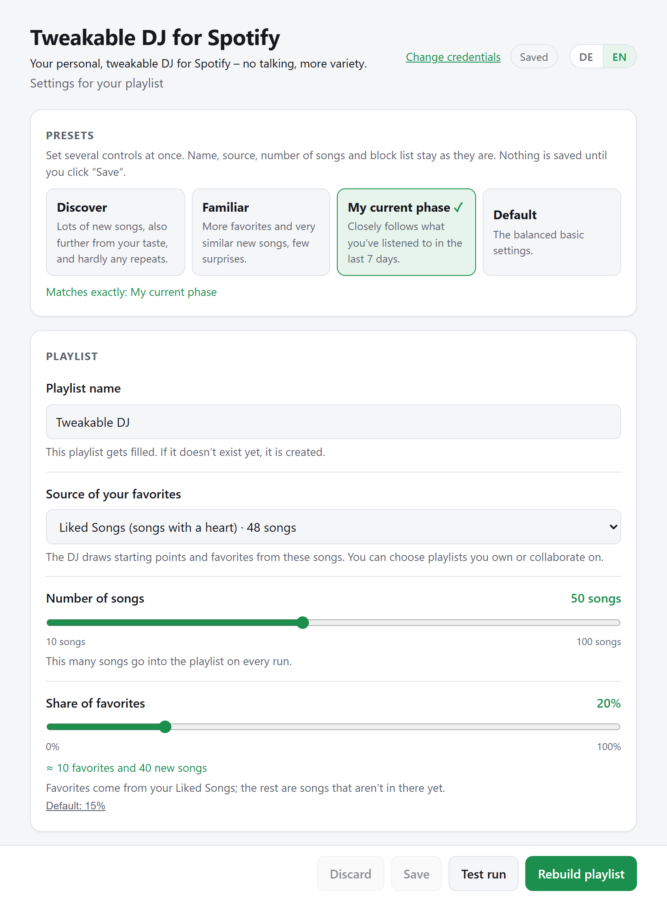
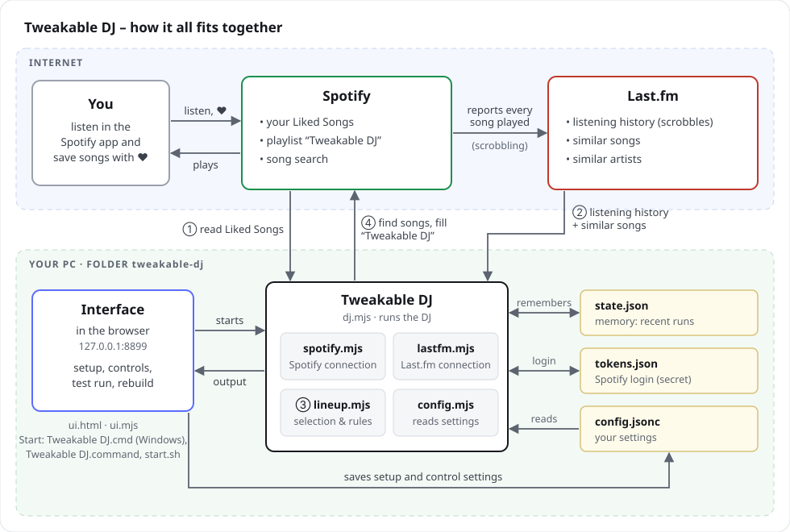
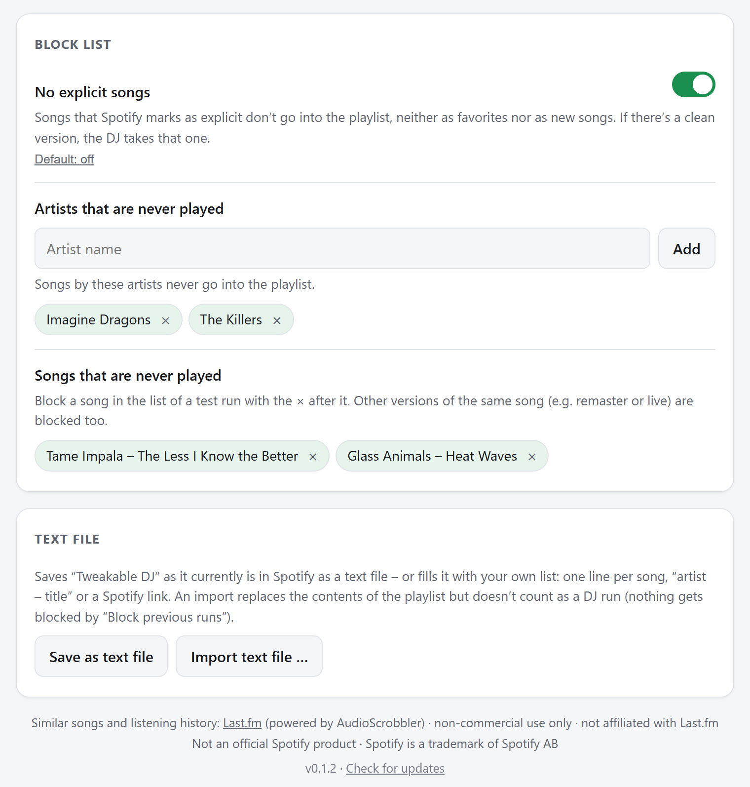
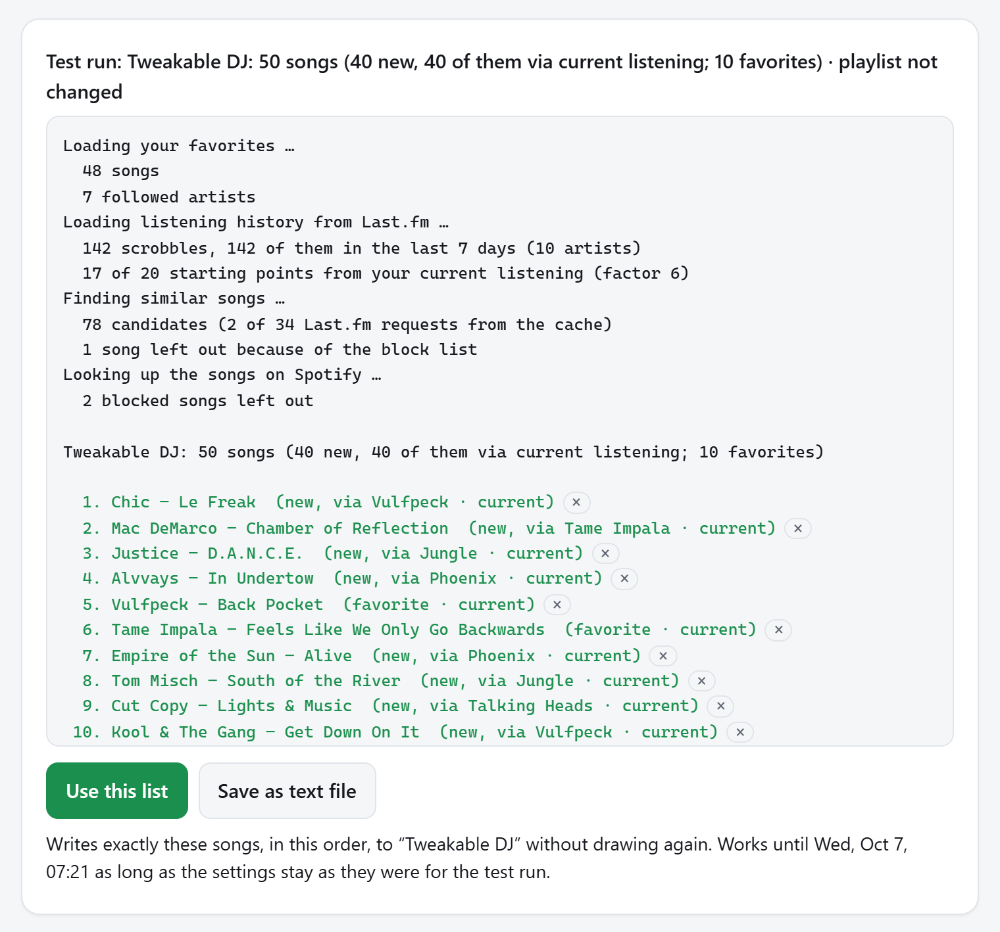
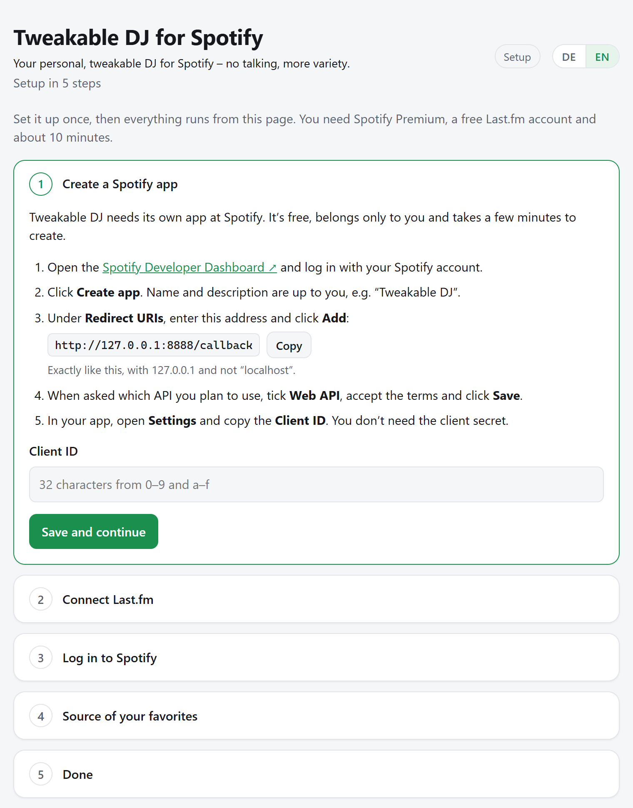

**English** · [Deutsch](README.de.md)

# Tweakable DJ for Spotify

**Your personal, tweakable DJ for Spotify – no talking, more variety.**

Spotify’s own AI DJ talks between the songs, and its voice can’t be turned off. Tweakable DJ does without announcements: it fills the playlist **“Tweakable DJ”** with a mix of your Liked Songs and new songs that match your taste, most of all what you’re listening to right now.
You decide how much variety you want, how many favorites, and how often the same artist comes up.
The interface is available in English and German, and also in Spanish and French (machine translated – corrections are welcome as an [issue](https://github.com/hayboeck/tweakable-dj-for-spotify/issues)); choose the language at the top right.

<p align="center"></p>

Tweakable DJ is an independent project and not an official Spotify product (more in [section 12](#12-data-sources-trademarks-and-license)).

> **What you need**
>
> - **Spotify Premium**. Tweakable DJ needs its own Spotify app, and Spotify only allows that with Premium.
> - A free **Last.fm account** connected to Spotify (“scrobbling”). That’s how the DJ knows your listening history.
> - **Node.js 18 or newer** (free, <https://nodejs.org>)
> - A **PC or Mac** with Windows, macOS or Linux. Tweakable DJ runs there, not on the internet.
> - About **10 minutes** for the [setup](#7-setup-one-time)
>
> Everyone sets up Tweakable DJ with their **own Spotify app**. Spotify allows at most 5 users per app in development mode. That’s why Tweakable DJ isn’t a service you sign up for, but a tool you set up on your own computer.

**Contents**

1. [Quick start](#1-quick-start)
2. [How it all fits together](#2-how-it-all-fits-together)
3. [What’s in the folder](#3-whats-in-the-folder)
4. [How a playlist is made](#4-how-a-playlist-is-made)
5. [Rules and settings](#5-rules-and-settings)
6. [Using Tweakable DJ](#6-using-tweakable-dj)
7. [Setup (one time)](#7-setup-one-time)
8. [Updating](#8-updating)
9. [Uninstalling](#9-uninstalling)
10. [Troubleshooting](#10-troubleshooting)
11. [Limitations](#11-limitations)
12. [Data sources, trademarks and license](#12-data-sources-trademarks-and-license)

---

## 1. Quick start

First time here? Download Tweakable DJ, install Node.js and start it as described in the [setup](#7-setup-one-time). On the first start, a wizard guides you through the rest (about 10 minutes). After that, it works like this every time:

1. Start Tweakable DJ: double-click **`Tweakable DJ.cmd`** (Windows) or **`Tweakable DJ.command`** (Mac); on Linux, run `./start.sh` in a terminal. The interface with its controls opens in your browser.
2. Pick a **preset** (e.g. “Discover”) or adjust the controls yourself, then click **Test run**. The DJ shows which songs it would pick and doesn’t change anything.
3. If you like the selection, click **Use this list** below it: exactly these songs go into “Tweakable DJ”, in this order. (**Rebuild playlist**, on the other hand, draws again and takes about a minute.)
4. Listen to “Tweakable DJ” in Spotify, ideally without shuffle, because the DJ has already mixed the order.

The console or terminal window that opens must stay open while you use the interface.

---

## 2. How it all fits together



The numbers show the order of a run:
① read your Liked Songs from Spotify → ② get listening history and similar songs from Last.fm → ③ pick songs according to your rules → ④ find the songs on Spotify and fill “Tweakable DJ”.

- **Spotify** provides your Liked Songs and receives the finished playlist. Since November 2024, Spotify no longer gives recommendations or related artists to newly created apps, and since February 2026 apps in development mode don’t get an artist’s top songs either. That’s why the suggestions come from Last.fm.
- **Last.fm** provides similar songs for each song and knows your listening history. For this, your Spotify account is connected to Last.fm (“scrobbling”), and every song you play is recorded there.
- **Tweakable DJ** runs on your computer, fetches the data from both services, picks songs according to your rules and writes the result into the playlist.
- **The interface** is a web page that runs only on your computer (<http://127.0.0.1:8899>). It guides you through the setup, changes the settings and starts the DJ.

“Tweakable DJ” is always **the same playlist with the same link**. Each run only replaces its contents.

---

## 3. What’s in the folder

**For using it**

| File | Purpose | Touch it? |
|---|---|---|
| `Tweakable DJ.cmd` | Starts the interface with a double-click (Windows) | yes, to start |
| `Tweakable DJ.command` | Starts the interface with a double-click (Mac) | yes, to start |
| `start.sh` | Starts the interface on Linux (`./start.sh` in a terminal). The Mac uses it too. | yes, to start |
| `config.jsonc` | All settings, each with an explanation on the same line. Also your credentials. Created during setup. | yes: via the interface or directly in an editor |
| `README.md` | This guide | read |
| `README.de.md` | This guide in German | read |
| `CHANGELOG.md` | What changed in each version (English and German) | read |

**Program** (only change it if you know what you’re doing)

| File | Purpose |
|---|---|
| `dj.mjs` | The DJ itself: controls a run from start to finish (steps in section 4) |
| `lineup.mjs` | The selection and ordering rules: the draw, “3 in 20”, gaps, comparing song titles |
| `trial.mjs` | Remembers the last test run for *Use this list* and checks whether it is still valid |
| `playlist.mjs` | Writes and reads the playlist; format and import of the [text file](#text-file-save-and-import) |
| `spotify.mjs` | Connection to Spotify: login, reading Liked Songs, finding songs, writing the playlist |
| `lastfm.mjs` | Connection to Last.fm: similar songs and artists, your listening history |
| `config.mjs` | Reads and writes `config.jsonc` without destroying the comments |
| `i18n.mjs` | All messages of the program and the server in English, German, Spanish and French (the interface texts are in `ui.html`) |
| `ui.mjs` | Small web server for the interface; starts the DJ at the push of a button |
| `ui.html` | The interface itself (setup wizard, controls, buttons, output), with all texts in English, German, Spanish and French |
| `schedule.mjs` | Automatic runs: adds Tweakable DJ to your system’s scheduler (Windows Task Scheduler, macOS launchd, Linux cron) and reads its status |
| `notify.mjs` | System notification when an automatic run fails, using only what your system has built in (Windows: PowerShell, Mac: `osascript`, Linux: `notify-send`) |
| `update.mjs` | Checks at most once a day whether a new version is available on GitHub (see [Update check](#update-check)) |
| `install-update.mjs` | Installs a new version when you click *Update now* (see [Updating](#8-updating)) |
| `manifest.json` | List of all program files of this version with their checksums. *Update now* only replaces files listed there. Only in the ZIP file, not in the GitHub repository. |
| `package.json` | Shortcuts for developers: `npm start` (interface) and `npm test` (tests). Tweakable DJ needs no additional packages. |
| `tests/` | Automated tests for the rules, the settings, the translations, automatic runs, the update check and *Update now*, the interface, the text file and test runs including applying them, in which Spotify, Last.fm and GitHub are only simulated. Only in the GitHub repository, not in the ZIP file. |
| `config.example.jsonc` | Empty settings template with English explanations. It becomes your `config.jsonc` when you set up in English, Spanish or French. |
| `config.example.de.jsonc` | The same template with German explanations (for setting up in German) |
| `overview.en.svg`, `overview.de.svg` | The diagram in section 2, in English and German |
| `docs/` | Screenshots of the interface for this guide, in English and German |
| `LICENSE` | The license (MIT), see section 12 |
| `.gitignore` | Makes sure `config.jsonc`, `tokens.json`, `state.json`, `lastfm-cache.json`, `probelauf.json`, the files of automatic runs, the result of the update check and `.update/` are never uploaded |
| `.gitattributes` | Consistent line endings for Windows, Mac and Linux; marks images as binary. Only in the GitHub repository, not in the ZIP file. |
| `.github/` | Templates for bug reports and ideas, automated workflows on GitHub (e.g. the ZIP file for new versions). Only in the GitHub repository, not in the ZIP file. |

**Created automatically** (don’t edit)

| File | Purpose |
|---|---|
| `tokens.json` | Your Spotify login and when you logged in. **Don’t share it** – it would give someone access to your playlists. |
| `state.json` | The DJ’s memory: which songs were in the last runs and which Spotify searches are already done. Deleting it resets both. That does no harm; the next run just takes a little longer. |
| `lastfm-cache.json` | Cached answers from Last.fm (similar songs and artists), each valid for 7 days. Makes runs faster. Deleting it does no harm. |
| `probelauf.json` | Result of the last test run (songs, time, fingerprint of the settings) for *Use this list* or `node dj.mjs --apply`. A real run and applying it delete the file. Deleting it does no harm. |
| `automatik.json` | Result of the last automatic run (time, ✓ or the reason it failed). The interface shows it under *Rebuild automatically* (tab *Settings*). |
| `automatik.log` | The complete output of the last automatic run, for troubleshooting |
| `update-check.json` | Result of the last [update check](#update-check) (time and newest version). Deleting it does no harm. |
| `.update/` | Created by *Update now*: the backup of the program files of the previous version (`backup-<version>`). Deleting it does no harm. |

`config.jsonc` contains your Client ID and your Last.fm key. Neither is very sensitive, but you still shouldn’t share them publicly.

---

## 4. How a playlist is made

The numbers are the defaults. Yours are in `config.jsonc` or in the interface. “Liked Songs” stands for the source of your favorites: if you chose one of your playlists there, it takes their place.

```
Liked Songs ─────┐
Last.fm top songs┼─► 20 starting points ─► ~150–200 candidates ─► new songs + favorites ─► order ─► “Tweakable DJ”
Listening now ───┘        (draw)              (Last.fm)              (draw + rules)        (rules)
```

1. **Set exclusions:** Whatever you played in the last 14 days, whatever was in the last 3 runs, everything by artists on your block list and the songs on it (in every version) stay out – and explicit songs, if you turned on *No explicit songs*.
2. **Draw starting points:** 20 songs are drawn from your Liked Songs, your Last.fm top songs and what you’re listening to right now. If you’ve just been playing a song or its artist, it is 3× as likely to be drawn.
3. **Collect candidates:** For each starting point, Last.fm provides the 30 most similar songs. Sometimes the DJ also takes a detour to a related artist a bit further away. Known Liked Songs and excluded songs are dropped. The DJ remembers Last.fm’s answers for 7 days, so the next run is faster.
4. **Pick favorites:** 15% of the playlist comes from your Liked Songs. Artists you’re listening to right now are preferred (and artists you follow on Spotify, if you set *Followed artists* that way).
5. **Draw new songs:** The candidates go into a lottery drum. “Adventure” sets how strongly similar songs are preferred; the factor sets how much current listening counts, and “Followed artists” how much artists you follow count. Every drawn song has to pass the artist limits and is looked up on Spotify. It only goes in if title and artist match.
6. **Set the order:** The DJ tries up to 200 orders and takes the one that best follows the rules.
7. **Fill the playlist:** The contents of “Tweakable DJ” are replaced, and the new songs are remembered as “already played”.

Chance plays a part in steps 2 to 6, so every run looks different.

Songs from “Tweakable DJ” that you save with the heart become new Liked Songs and therefore starting points from the next run on.

---

## 5. Rules and settings

Every rule can be changed in `config.jsonc` or in the interface. The setting’s name is in parentheses. “Default” is the value the DJ uses if you haven’t set your own.

“Allowed” is what `config.jsonc` accepts; counts, days and runs are whole numbers. The controls in the interface cover the usual range. A larger value from `config.jsonc` is still shown correctly and kept as it is. If a value is outside the allowed range, the interface marks it in red and a run stops with a message such as “size in config.jsonc must be a whole number from 1 to 500 (currently 0).”

**What goes into the playlist**

| Rule | Default | Allowed |
|---|---|---|
| Name of the playlist (`playlistName`). If it doesn’t exist, it is created. | Tweakable DJ | any name |
| Source of your favorites (`seed`): your Liked Songs (`"liked"`) or one of your own or collaborative playlists. Favorites and most starting points come from here. | Liked Songs | `"liked"` or a playlist link |
| Length of the playlist (`size`) | 50 songs | 1–500 |
| Share of favorites (`familiarShare`). The rest are new songs that aren’t in the source of your favorites. | 15% (≈ 8 songs) | 0–1 (`0.15` = 15%) |
| Adventure (`adventure`): 0 = prefer similar songs, 0.5 = no preference, 1 = prefer distant songs. Also sets for how many starting points the DJ wanders off to related artists. | 0.4 | 0–1 |
| Starting points per run (`seedsPerRun`) | 20 | 1–200 |
| Also use your Last.fm top songs of the last 3 months as starting points (`useLastfmTopTracks`) | on | `true` or `false` |
| Followed artists (`followedArtists`): artists you follow on Spotify. -1 = none of them (like the block list, also as a guest via “feat.”), below 0 = less often, 0 = no preference (the list isn’t even fetched), above 0 = more often, 1 = strongly preferred, but not exclusively. Applies to new songs and favorites, not to the starting points. | 0 (no preference) | -1–1 |

How *Followed artists* works: a song by an artist you follow gets a factor on its lottery ticket of 10 to the power of the setting, so 0.5 = 3.2× as likely, 1 = 10× as likely, -0.5 = ⅓ as likely; at -1, such songs are left out entirely. The factor is multiplied with the other weights (adventure, factor for current listening), and the limits per artist still apply, so the playlist doesn’t fill up with followed artists only. Names are compared like everywhere else (upper/lower case, accents and a leading “The” don’t matter), but only whole names count: following “Queen” doesn’t include “Queen Latifah”. If you logged in to Spotify before this setting existed, log in again once (the interface shows a notice). Until then, a run shows a warning and continues as if the setting were 0.

**What you’re listening to now counts more**

| Rule | Default | Allowed |
|---|---|---|
| “Current” is everything Last.fm says you played in this period (`currentDays`). 0 = off. | 7 days | 0–365 |
| Factor for current listening (`currentFactor`), 1 = off. With factor 3: | 3 | 1–100 |
| – A starting point is drawn 3× as often if you’re currently playing the song or its artist. The songs you’re currently playing are starting points too. | | |
| – A new song found via such a starting point is 3× as likely to be drawn. | | |
| – Favorites by artists you’re currently playing are picked 3× as often. | | |

In the output, such songs are marked with “· current” (in German “· aktuell”).

**What stays out of the playlist**

| Rule | Default | Allowed |
|---|---|---|
| Recently played (`excludeRecentDays`): everything Last.fm says you played in this period. 0 = off. | 14 days | 0–365 |
| Previous runs (`noRepeatRuns`): songs from the last N runs. 0 = off. | 3 runs | 0–100 |
| Block list (`blockedArtists`): artists that never come up, neither as a song nor as a starting point nor as a detour. Whole words count: “Macloud” also blocks “Miksu / Macloud” and “feat. Macloud”, but “Rin” doesn’t block “Karin”. | none | list of names |
| Blocked songs (`blockedTracks`): single songs that never come up, neither as a favorite nor as a new song nor as a starting point. A song counts as the same if it has the same Spotify link or the same artist and title, ignoring additions like “Remastered 2011”, “(Live)” or “feat.” – so other versions are blocked too. Easiest with × in the list of a test run ([Block list](#block-list-artists-and-songs)). | none | at most 1,000 entries `{ "uri": "spotify:track:…", "artist": "…", "name": "…" }` (`uri` may be missing) |
| No explicit songs (`excludeExplicit`): songs that Spotify marks as explicit stay out – favorites, new songs and the top-up with favorites. If Spotify has a clean version of a new song, the DJ takes that one. Starting points stay, because they only decide what Last.fm looks for. | off | `true` or `false` |
| Songs that can’t be found unambiguously on Spotify (title and artist must match). Additions like “Remastered” or “feat.” are ignored in the comparison. | always | |

**How often the same artist comes up**

In the interface, a single slider **Artist variety** sets the four rules below together. *Medium* is the default, so nothing changes if you never touch it:

| Step | Songs per artist | Same artist in a row of songs | Gap between songs by the same artist |
|---|---|---|---|
| low | at most 4 | at most 4 in 15 | at least 2 songs |
| medium (default) | at most 2 | at most 3 in 20 | at least 4 songs |
| high (= preset *Discover*) | at most 2 | at most 2 in 20 | at least 4 songs |
| very high | 1 | at most 2 in 20 | at least 8 songs |

Every step works with 50 songs and a typical library. If the source of your favorites has only a few artists, “very high” may find fewer songs or break a rule; the DJ then shows a warning (⚠). If your four values don’t match any step (e.g. changed by hand in `config.jsonc`), the slider shows *Custom*. Moving it overwrites all four values; *Discard* brings back the saved ones.

**For experts:** the four individual values. In the interface they are under *Details for experts*; in `config.jsonc` they stay as they are.

| Rule | Default | Allowed |
|---|---|---|
| At most N songs per artist in the whole playlist (`maxPerArtist`) | 2 | 1–500 |
| In every 20 consecutive songs, at most 3 songs for the same artist (`artistWindow`, `maxPerWindow`). This counts songs *by* the artist and new songs found *via* them (e.g. “new, via artist X”). With 50 songs, that’s at most 8 per artist. | 3 in 20 | 1–100 each |
| Gap between two songs by the same artist (`artistGap`). 0 = off. | at least 4 songs in between | 0–50 |

**When not everything is possible at once**

- If the DJ finds too few new songs, it fills up with more favorites. These may include favorites you played recently or that were in the last runs.
- For the order, “3 in 20” takes priority over the minimum gap.
- If a rule is still broken, the DJ shows a warning (⚠).

**Automatic runs**

The schedule itself (`schedule`, `scheduleTime`, `scheduleDay`) is easiest to set in the interface, see [Using Tweakable DJ](#with-the-interface).

| Setting | Default | Allowed |
|---|---|---|
| Notify on failures (`notifyOnFailure`): if an automatic run fails, your system shows a notification with the reason and what to do (e.g. “Your Spotify login has expired. Open Tweakable DJ and log in to Spotify again.”). From 10 days before your Spotify login expires, a successful automatic run also reminds you, at most once a day. Runs from the interface or the terminal never notify. | on | `true` or `false` |

**Language**

| Setting | Default |
|---|---|
| Language of the interface and the output (`language`): `"en"` = English, `"de"` = German, `"es"` = Spanish, `"fr"` = French, `""` = not chosen yet. Also applies to automatic runs and the terminal. | `""`: the language of your browser (interface) or your system (terminal, automatic runs) |

---

## 6. Using Tweakable DJ

### With the interface

Double-click `Tweakable DJ.cmd` (Windows) or `Tweakable DJ.command` (Mac); on Linux, run `./start.sh` in a terminal. `node ui.mjs` in a terminal works everywhere too. Your browser opens <http://127.0.0.1:8899>.
On the very first start, your system may ask for confirmation, see [setup](#7-setup-one-time), step 3. If Tweakable DJ isn’t set up yet, the setup wizard appears instead of the controls.

The page has two tabs: **Playlist** (presets, controls, output with text file and test run) and **Settings** (automatic runs, block list, credentials, version).

- **Language** (top right, a small selection field, e.g. **EN ▾**, with Deutsch, English, Español and Français): switches the whole interface immediately, including the wizard. Your choice is saved in `config.jsonc` (`language`) and then also applies to test runs, rebuilds, automatic runs and the terminal. Until you choose, the interface follows your browser’s language. Spanish and French are machine translated; a line at the bottom of the page says so and links to the [issues](https://github.com/hayboeck/tweakable-dj-for-spotify/issues), where corrections are welcome.
- **Presets**: four buttons set all rule controls at once:
  - *Discover*: lots of new songs, also further from your taste
  - *Familiar*: more favorites and very similar songs
  - *My current phase*: closely follows what you’re listening to right now
  - *Default*: the basic settings

  Name, source, number of songs, followed artists and block list stay as they are. If your settings match a preset exactly, it is highlighted.
- **Controls**: each setting has a control, an explanation and a green hint showing what the value does right now. If a value differs from the default, clicking “Default: …” resets it. A value from `config.jsonc` outside the allowed range is marked in red ([Rules and settings](#5-rules-and-settings)).
- **Artist variety**: one slider with four steps (*low* to *very high*) sets all four artist rules at once. The individual values are under *Details for experts*; if they don’t match any step, the slider shows *Custom* and the details open.
- **Source of your favorites**: a list with your Liked Songs and your playlists. Only playlists you own or collaborate on are offered, because Spotify only shares the contents of those.
- **Block list** (tab *Settings*): artists, single songs and explicit songs, see [Block list](#block-list-artists-and-songs) below.
- **Save / Discard**: changes are only written to `config.jsonc` when you click *Save*. They apply to both tabs; a dot on the other tab shows unsaved changes there. The tab *Settings* shows only these two buttons.
- **Test run**: shows the selection without changing the playlist. Below it:
  - **Use this list**: writes exactly these songs, in this order, to “Tweakable DJ” without drawing again, including the description. It counts like a run (the songs are then remembered for *Block previous runs*). The button is valid for 24 hours and only as long as the settings stay as they were for the test run; after that, after a rebuild (also by automatic runs) or if `probelauf.json` is missing, it is disabled and says why. Then just start a new test run. Setting the controls back makes it available again.
  - **Save as text file** (below the output): after a test run, it downloads the list of the test run, even if it isn’t in the playlist (yet); the file name ends in `-test-run`.
- **Rebuild playlist**: draws again, refills “Tweakable DJ” and then shows a link to Spotify.
- **Output**: always visible; before the first run it shows a short placeholder. Below it are the buttons for the text file: *Save as text file* downloads “Tweakable DJ” as it currently is in Spotify (after a test run: the list of the test run, see above). *Import … → From file …* fills it with your own list: first a preview (“38 of 40 found” and the lines that don’t match), then *Write to playlist “Tweakable DJ” (replaces its contents)*. More under [Text file](#text-file-save-and-import).
- **Credentials** (tab *Settings*): shows whether you’re logged in to Spotify and your Last.fm username. **Change credentials** opens the setup wizard with your previous entries.
- **Log in with Spotify**: appears when your Spotify login expires soon or has expired. Spotify requires a new login every 6 months. It also appears if *Followed artists* isn’t at “no preference” and your login is from before that setting existed.
- **Rebuild automatically** (tab *Settings*): *Off*, *Daily* or *Weekly*, plus the time and, if needed, the day of the week. When you click *Save*, Tweakable DJ adds itself to your system’s scheduler and then rebuilds the playlist by itself, even when the interface is closed. Below, you see the next run and the result of the last automatic run (✓ with the number of songs or ✗ with the reason). What happens if your computer is off at the set time:
  - Windows: the run is made up the next time you turn it on.
  - Mac: the run is made up after waking from sleep, but not after being switched off.
  - Linux: the run is skipped.

  **Notify on failures** (on by default, shown while automatic runs are on): if an automatic run fails – Spotify login expired, Last.fm key invalid or suspended, no internet, setup or `config.jsonc` broken – your system shows a notification: “Tweakable DJ: automatic run failed”, the reason and what to do. From 10 days before the Spotify login expires, it also reminds you to log in again (at most once a day). **Send test notification** shows one right away, so you can check that notifications get through; the result appears next to the button. Tweakable DJ only uses what your system has built in:
  - Windows: a notification from *Windows PowerShell* (that’s the sender shown). If none appears, check *Do not disturb* and *Settings › System › Notifications › Windows PowerShell*.
  - Mac: a notification from *Script Editor* (`osascript`). The first time, macOS may ask whether it may show notifications.
  - Linux: `notify-send` (package `libnotify-bin` or `libnotify`). Without it, or without a desktop session, there is simply no notification.

  If a notification can’t be shown, the run still counts as usual; `automatik.log` then contains a short note why.
- **New version**: if a newer version of Tweakable DJ has been released, a notice appears at the top with a download link and the button **Update now** (see [Updating](#8-updating)). Close it with ×; it only comes back for the next version. The tab *Settings* shows under *Version* which version you have (e.g. *v0.1.3*), next to it **Check for updates**: it asks GitHub right away and then says *You’re up to date ✓*, shows the notice again (even if you closed it) or says *GitHub not reachable*. More in [Update check](#update-check).

*Test run* and *Rebuild playlist* save first automatically. The interface can only be reached from your own computer; other devices on the network and other websites have no access.

### Block list: artists and songs

The group *Block list* (tab *Settings*) has three parts. Like every setting, changes are only written to `config.jsonc` when you click *Save* (a test run saves first by itself).

- **No explicit songs**: a switch. When it’s on, no song that Spotify marks as explicit goes into the playlist ([Rules and settings](#5-rules-and-settings)). A test run then shows e.g. “4 explicit songs left out”.
- **Artists that are never played**: enter a name and click *Add*. Remove it again with ×.
- **Songs that are never played**: after a test run, every song in the list has a small **×**. Clicking it blocks the song: it is struck through, appears as a chip under *Songs that are never played* and stays out of every run from then on, including other versions of it (remaster, live, a single with its own link). **↺** next to a struck-through song, or × on the chip, unblocks it. A test run shows e.g. “2 blocked songs left out”.

<p align="center"></p>

If you block a song from the list of a test run, *Use this list* is disabled (that list contains the song). Start a new test run; it saves your changes first.

The block list doesn’t apply to an import from a text file: it’s your list. The preview names the songs a run of the DJ would leave out (“on your block list”, “explicit”), and they still go in.

<p align="center"></p>

### In the terminal

In the `tweakable-dj` folder ([how to open a terminal there](#open-a-terminal-in-the-folder)):

```
node dj.mjs          # refill the playlist
node dj.mjs --dry    # test run: only show, don't change the playlist (remembers the list in probelauf.json)
node dj.mjs --apply  # write the last test run to the playlist exactly as it is, without drawing again (--dry: only check)
node dj.mjs export [file.txt]   # save the playlist as a text file (default: tweakable-dj-<date>.txt)
node dj.mjs import <file.txt>   # write the songs from a text file to the playlist (--dry: only show)
node dj.mjs login    # log in to Spotify (again)
node dj.mjs --auto   # like an automatic run: also writes automatik.log and automatik.json
node ui.mjs          # start the interface (also: npm start)
node ui.mjs --no-browser   # the same, without opening the browser
npm test             # automated tests; Spotify, Last.fm and GitHub are only simulated
```

The output uses the language from `config.jsonc` (`language`), otherwise your system’s language. Three environment variables help in special cases:

| Variable | Effect |
|---|---|
| `TWEAKABLE_DJ_LANG` | `en`, `de`, `es` or `fr`: language of the output for this call, takes priority over `language` |
| `TWEAKABLE_DJ_PORT` | A different port for the interface instead of 8899, e.g. if 8899 is already in use |
| `TWEAKABLE_DJ_NO_UPDATE_CHECK` | `1`: don’t check for new versions (see [Update check](#update-check)) |

Example on macOS and Linux: `TWEAKABLE_DJ_LANG=de node dj.mjs --dry`. In the Windows command prompt: first `set TWEAKABLE_DJ_LANG=de`, then `node dj.mjs --dry`.

You don’t need to set the other variables yourself: the start files set `TWEAKABLE_DJ_LAUNCHER=1` (then the interface restarts by itself after *Update now*), and the tests use `TWEAKABLE_DJ_TASK_NAME` and `TWEAKABLE_DJ_TASK_ARGS` so they never touch the real scheduler entry.

### Text file: save and import

*Save as text file* (or `node dj.mjs export`) writes a UTF-8 file with one line per song:

```
# Tweakable DJ – exported on 10/5/2026, 02:03 PM · https://open.spotify.com/playlist/…
# 50 songs · one line per song: artist – title, tab, Spotify link
Main artist, Guest – Title	https://open.spotify.com/track/…
```

- Lines starting with `#` are comments. The artists are listed as Spotify names them: the main artist first, guests after it, separated by commas.
- A tab separates the title from the link: it never appears in names or titles (two spaces can), and spreadsheet programs turn it into two columns.

*Import … → From file …* (or `node dj.mjs import <file.txt>`) reads such a file, but also a list of your own:

- Empty lines and lines starting with `#` don’t count. (Exception: `#` directly before a name on a line with a link to a song, so artists like “#1 Dads” aren’t lost.)
- A link or URI to a song (`https://open.spotify.com/track/…`, also with `?si=…`, or `spotify:track:…`) is used directly, whatever else is on the line. That way a saved file comes back exactly the same.
- Otherwise the line must read `artist – title` (separator `–`, `—` or ` - ` with spaces). Tweakable DJ looks these songs up on Spotify, just like during a run.
- At most 500 songs and 1 MB. The preview shows how many were found and which lines don’t match; nothing is written until you confirm. With many songs the search takes a while; the progress is shown below the buttons.
- Songs from your block list – and, with *No explicit songs*, explicit ones – aren’t left out, but the preview lists them as a note. For lines with only a link, Tweakable DJ doesn’t know whether a song is explicit (that would take one extra request per song).
- An import replaces the contents of the playlist and sets its description, **but doesn’t count as a DJ run**: it writes nothing to the history (`state.json`), so its songs aren’t blocked by *Block previous runs*. It’s your list, not the DJ’s selection.
- No import starts during a run, an update or a Spotify login, and vice versa.

### Update check

When you open the interface, Tweakable DJ checks **at most once a day** whether a new version has been released. For this, it sends a single request to the GitHub Releases API (`api.github.com`) that asks for the newest release of Tweakable DJ. **No personal data is sent**: no settings, credentials, songs or IDs. The answer is stored in `update-check.json`; if the check fails (e.g. offline), it tries again an hour later at the earliest. Only the interface checks, not runs in the terminal or automatic runs. It only shows a notice and never downloads or installs anything by itself; an update only happens when you click *Update now* (see [Updating](#8-updating)).

**Check for updates** in the tab *Settings*, next to the version number, asks GitHub right away, regardless of the daily rhythm – at most once a minute; another click within that minute shows the last result again.

To turn the check off, set the environment variable `TWEAKABLE_DJ_NO_UPDATE_CHECK=1` before starting:

- macOS and Linux: `TWEAKABLE_DJ_NO_UPDATE_CHECK=1 node ui.mjs`, or permanently with `export TWEAKABLE_DJ_NO_UPDATE_CHECK=1` in your shell profile (e.g. `~/.zshrc` or `~/.profile`)
- Windows: permanently with `setx TWEAKABLE_DJ_NO_UPDATE_CHECK 1` in the command prompt (once), then restart Tweakable DJ

---

## 7. Setup (one time)

You do these steps once before using Tweakable DJ for the first time, and again when you move to a new computer. It takes about 10 minutes.

1. **Download Tweakable DJ**: on the GitHub page of Tweakable DJ, click *Releases* on the right. For the newest version, download the file `tweakable-dj-v….zip` under *Assets* and unzip it (Windows: right-click → *Extract All*, Mac: double-click). Put the `tweakable-dj` folder in a permanent place, e.g. in *Documents*. Don’t start it directly from inside the ZIP file, or your settings will be lost. (If you use git, you can clone the repository instead.)
2. Install **Node.js** (<https://nodejs.org>, version 18 or newer). The DJ needs no other packages.
3. **Start Tweakable DJ** as described in the [quick start](#1-quick-start). The very first time, your system usually asks for confirmation because the file comes from the internet:
   - **Windows**: if “Windows protected your PC” appears, click *More info* → *Run anyway*. If “The publisher could not be verified” appears, click *Run*.
   - **Mac**: start `Tweakable DJ.command` with **right-click → Open** and choose *Open* again in the dialog. If the dialog offers no *Open* (newer macOS versions), close it and click *Open Anyway* further down under *System Settings → Privacy & Security*. After that, a double-click is enough.
   - **Linux**: in a [terminal in the folder](#open-a-terminal-in-the-folder) `tweakable-dj`, enter `./start.sh`.
   - **Mac and Linux, if “permission denied” appears**: the start file has lost its execute permission (happens e.g. when the folder was copied via Windows). In a [terminal in the folder](#open-a-terminal-in-the-folder) `tweakable-dj`, enter `chmod +x "Tweakable DJ.command" start.sh` once. On Linux, `sh start.sh` also works without that.
4. **Go through the setup wizard.** It appears in your browser by itself, explains each step with links and checks your entries right away. You can switch between English, German, Spanish and French at the top right at any time.
   1. **Create a Spotify app** in the [Spotify Developer Dashboard](https://developer.spotify.com/dashboard). The redirect URI `http://127.0.0.1:8888/callback` is important – exactly like this, not with `localhost` (the wizard has a copy button for it). You enter the **Client ID** in the wizard. The client secret isn’t needed.
   2. **Last.fm**: [create an API key](https://www.last.fm/api/account/create) (leave the callback URL empty) and enter it together with your Last.fm username. *Check* shows whether both are right and how many scrobbles Last.fm already knows from you. If it says 0, connect Spotify to Last.fm under [last.fm → Settings → Applications](https://www.last.fm/settings/applications).
   3. **Log in with Spotify**: a Spotify page opens; agree there.
   4. Choose the **source of your favorites**: your Liked Songs or one of your playlists.
   5. **Done**: the controls appear and you can start your first test run.

   The wizard creates the file `config.jsonc` by itself, with explanations in the language you have selected (in English for Spanish and French). Later, you can reach it via *Change credentials* in the tab *Settings*.

   <p align="center"></p>

**Setting up without the interface** (for those who prefer the terminal):

1. Copy `config.example.jsonc` (English explanations) or `config.example.de.jsonc` (German explanations) to `config.jsonc` and fill in:
   - `spotify.clientId`
   - `lastfm.apiKey`
   - `lastfm.user`: your Last.fm username
   - `seed`: `"liked"` for the songs you saved with the heart, or the link to one of your own playlists
   - `language`: `"en"`, `"de"`, `"es"` or `"fr"` (empty = your system’s language)
2. Run `node dj.mjs login` and agree in the browser.

<a id="open-a-terminal-in-the-folder"></a>**Open a terminal in the folder**

- Windows: in the `tweakable-dj` folder, type `cmd` into the address bar at the top and press Enter
- Mac: open the *Terminal* app, type `cd ` (with a space), drag the `tweakable-dj` folder into the window and press Enter
- Linux: in the file manager, right-click in the folder → *Open in Terminal*

---

## 8. Updating

When a new version is out, a notice appears at the top of the interface. What changed is listed in [CHANGELOG.md](CHANGELOG.md). Either way of updating keeps **your personal files exactly as they are**: `config.jsonc` (settings, Client ID, Last.fm key and username), `tokens.json` (Spotify login), `state.json` (history), `lastfm-cache.json`, `probelauf.json` (last test run) and the files of automatic runs. They aren’t in the ZIP file, and an update never writes them.

**With the button**

1. Click **Update now** in the notice. Tweakable DJ shows which version you’ll get, with a link to the release notes.
2. Click **Update**. Tweakable DJ downloads the new version from GitHub, checks every file against its checksum (SHA-256), backs up the files it replaces to `.update/backup-<old version>` and copies the new files in.
3. Tweakable DJ restarts by itself, and the page reloads with the new version. If you started it with `node ui.mjs` in a terminal instead of a start file, start it again yourself; the page then reloads by itself.

The update only writes the program files listed in the release (`manifest.json`) and deletes nothing outside `.update/` (there it only keeps the backup of the latest update). If a file doesn’t match its checksum, it changes nothing; if copying fails, it restores the old version automatically. It doesn’t start while a test run, a rebuild, an automatic run, an import from a text file or a Spotify login is in progress. Automatic runs keep working, because the folder stays the same.

**By hand**

1. Download `tweakable-dj-v….zip` of the new version from *Releases* on GitHub (as in [setup](#7-setup-one-time), step 1) and close the Tweakable DJ window.
2. Unzip it **over your existing `tweakable-dj` folder** and replace the files:
   - Windows: right-click the ZIP file → *Extract All*, choose the folder that **contains** your `tweakable-dj` folder (e.g. *Documents*) as the destination and confirm *Replace the files in the destination*.
   - Mac and Linux: in a terminal, `unzip -o ~/Downloads/tweakable-dj-v….zip -d <folder that contains tweakable-dj>`. Don’t drag the new folder onto the old one in the Finder: the Finder replaces the whole folder, including your personal files.
3. Start Tweakable DJ as usual. (Mac: the first start may again need right-click → *Open*.)

Your personal files aren’t in the ZIP file, so they stay as they are, and automatic runs keep working because the folder stays the same. **Don’t unzip into a new folder** and use that one instead: it would have neither your settings nor your login, and automatic runs would still point to the old folder. If you do want to move to a new folder, copy `config.jsonc`, `tokens.json`, `state.json` and `lastfm-cache.json` from the old folder into the new one, start Tweakable DJ there and click *Save automatic runs* once.

**With git**: if you cloned the repository, run `git pull` in the folder. Your personal files are in `.gitignore`, so git doesn’t touch them. In a git folder, the interface doesn’t offer *Update now*.

---

## 9. Uninstalling

1. **First turn automatic runs off:** in the interface, in the tab *Settings*, set *Rebuild automatically* to *Off* and click *Save*. That removes the entry from your system’s scheduler.
2. Close the Tweakable DJ window and delete the `tweakable-dj` folder. Your personal files (settings, Spotify login, history) go with it.
3. If you like: delete the playlist in Spotify (by default “Tweakable DJ”) and your Spotify app in the [Spotify dashboard](https://developer.spotify.com/dashboard).

**If you delete the folder while automatic runs are still on**, the entry stays in the scheduler. It keeps starting at the set time, but each run fails silently because the folder is gone, and the playlist is no longer rebuilt. You can remove the entry by hand:

- **Windows:** open *Task Scheduler*, click *Task Scheduler Library*, right-click *Tweakable DJ* → *Delete*. Or in the command prompt: `schtasks /Delete /TN "Tweakable DJ" /F`
- **macOS:** in the terminal:
  ```sh
  launchctl bootout gui/$(id -u)/io.github.tweakable-dj.auto
  rm ~/Library/LaunchAgents/io.github.tweakable-dj.auto.plist
  ```
- **Linux:** run `crontab -e` in the terminal and delete the line containing `tweakable-dj-auto`.

There is only ever one entry: it always has the same name, whichever folder it comes from. If you install Tweakable DJ again in a different folder, the interface shows “Automatic runs still point to a different folder”, and saving replaces the entry. There is never a second one.

---

## 10. Troubleshooting

| Message / problem | Solution |
|---|---|
| “Spotify login expired” | Spotify requires a new login every 6 months: click *Log in with Spotify* in the interface (or run `node dj.mjs login`). The interface reminds you about 10 days in advance. |
| “Not logged in to Spotify yet” | `tokens.json` is missing: click *Log in with Spotify* in the interface (or run `node dj.mjs login`) |
| ⚠ “For "Followed artists", please log in to Spotify again once” | Your Spotify login is from before this setting existed and isn’t allowed to read the artists you follow. Click *Log in with Spotify* in the interface (or run `node dj.mjs login`). Until then, followed artists don’t count; the run itself works as usual. |
| “Spotify denies access (403)” | The owner of the Spotify app needs Premium (required in development mode). If someone else uses your app, their account must be added in the [Spotify dashboard](https://developer.spotify.com/dashboard) under *User Management*. |
| Spotify page shows “INVALID_CLIENT: Invalid client” | The Client ID is wrong: copy it again from the dashboard via *Change credentials* |
| Spotify page shows “INVALID_CLIENT: Invalid redirect URI” | In the dashboard under *Settings*, the redirect URI must be exactly `http://127.0.0.1:8888/callback` (add it with *Add* and save) |
| “Port 8888 is in use” | A login is already running, e.g. in a terminal. Stop it and try again. |
| “The Last.fm API key is invalid” | Copy the key from Last.fm again via *Change credentials*: the *API key* field, not *Shared secret* |
| “Last.fm has suspended your API key” | Last.fm has blocked the key (rare, e.g. after misuse). Create a new key at [last.fm/api/account/create](https://www.last.fm/api/account/create) and enter it via *Change credentials* |
| “The Last.fm user … doesn’t exist” | Check the spelling of your Last.fm username via *Change credentials* |
| “Last.fm has no scrobbles from …” | Spotify is probably not connected to Last.fm: connect it under [last.fm → Settings → Applications](https://www.last.fm/settings/applications). Until then, the rules for current listening don’t apply. |
| “config.jsonc is invalid” | Usually a comma is missing at the end of a line, or there is one too many (there must be none after the last entry) |
| “… in config.jsonc must be a whole number from … to …” | A value in `config.jsonc` was changed by hand and is outside the allowed range ([Rules and settings](#5-rules-and-settings)). Correct it there, or set the control in the interface and save. |
| “The source of your favorites (playlist) is empty or can’t be read” | Spotify only returns playlists you own or collaborate on. In the interface, choose a playlist from the list under *Source of your favorites*; only readable ones are listed there. |
| “A run is already in progress” | Wait until the current test run or rebuild is finished (about 1 minute) |
| *Use this list* is disabled, or “There’s no test run to apply” | A test run is valid for 24 hours and only with the same settings; a rebuild (also by automatic runs) ends it. The reason is shown below the button. Start a new test run. |
| Import: “Line …: not found on Spotify” | Check the spelling of artist and title, or paste the link to the song instead of its name (in Spotify: Share → Copy link) |
| “Update failed: …” | The message says whether nothing was changed or the old version was restored. Try again later, or update by hand ([Updating](#8-updating)). |
| The interface doesn’t open / page can’t be reached | The console or terminal window of Tweakable DJ was closed: start Tweakable DJ again |
| “Node.js was not found”, “Node.js is not installed” or “'node' is not recognized as an internal or external command” | Install Node.js ([setup](#7-setup-one-time), step 2) and restart Tweakable DJ. If it still doesn’t work, log out and back in once. |
| “Node.js is too old” or “Tweakable DJ needs Node.js 18 or newer” | Install the newest version from <https://nodejs.org> |
| Mac: “… can’t be opened because it is from an unidentified developer” | The first time, start it with right-click → *Open* ([setup](#7-setup-one-time), step 3) |
| Mac/Linux: “permission denied” | Run `chmod +x "Tweakable DJ.command" start.sh` once in the `tweakable-dj` folder ([setup](#7-setup-one-time), step 3) |
| Warning ⚠ “The rule … couldn’t be kept everywhere” | The rules are too strict for the songs found, e.g. “1 in 20” with 50 songs. Set *Artist variety* one step lower, or relax one rule under *Details for experts*. |
| Many songs via the same artist | For some artists and genres, Last.fm returns many more similar songs than for others. Set *Artist variety* higher, or reduce “Songs per artist in the window” under *Details for experts*. |
| Current listening barely counts | Check whether Last.fm records your listening (last.fm → your profile). Increase the factor. |
| A particular song is never found | If Spotify can’t find a song, the DJ remembers that in `state.json` (search errors, e.g. without internet, are not remembered). Delete `state.json` to search again. |
| Similar songs should come fresh from Last.fm | Delete `lastfm-cache.json`. Otherwise the DJ keeps using Last.fm’s answers for up to 7 days. |
| An automatic run didn’t happen | Under *Rebuild automatically* you see the reason for the last run. Common causes: the computer was off (see [Using Tweakable DJ](#with-the-interface)), or the Spotify login has expired (then click *Log in with Spotify*). Details are in `automatik.log`. |
| No notification after a failed automatic run | Is *Notify on failures* on? Click *Send test notification*: if it reports an error, that says why; if it says *Sent* but nothing appears, check *Do not disturb* and the notification settings of your system (Windows: *Windows PowerShell*, Mac: *Script Editor*). On Linux, `notify-send` must be installed. |
| “Automatic runs still point to a different folder” | The folder was moved or copied. Click *Save automatic runs* once, and the scheduler entry points to the right folder again. |
| “The scheduler still has an entry under the old name …” | Automatic runs were set up under the project’s former name. Click *Save automatic runs* once (or *Remove entry* if automatic runs are off), and Tweakable DJ replaces the old entry. |
| Interface or output in the wrong language | Choose the language at the top right (e.g. **EN ▾**). That saves `language` in `config.jsonc`, which from the next run on also applies to automatic runs and the terminal. |
| Deleting or moving the folder | First set automatic runs to *Off* and save. Otherwise an entry stays behind in the scheduler that leads nowhere ([Uninstalling](#9-uninstalling)). |

---

## 11. Limitations

- **No endless mode:** the playlist has a fixed length. When it has finished, Spotify’s autoplay takes over (if enabled), which doesn’t know your rules. For new songs, click “Rebuild playlist”.
- **Automatic runs need your computer:** Tweakable DJ runs on your PC or Mac, not on the internet. The computer must be on at the set time. Missed runs are made up by Windows the next time it starts, by the Mac only after sleep, and not at all by Linux. Automatic runs haven’t been tested on a real Mac yet.
- **Large libraries:** of your Liked Songs, the DJ uses the 1,000 you saved most recently.
- **Listening history:** per run, the DJ fetches at most the 1,000 newest scrobbles from Last.fm, from the longer of the two periods `excludeRecentDays` and `currentDays` (14 days by default). If you listen to more, the oldest days of that period are missing: songs from those days aren’t blocked as recently played and don’t count as current listening. With the defaults, blocking recently played songs (14 days) is affected from about 70 songs a day, “current” (7 days) only from about 140 a day. With long periods (e.g. `excludeRecentDays` 90), the limit is reached much sooner. The line “… scrobbles, …” in the output shows how many were fetched; 1,000 means the limit was reached.
- **Spotify’s rules:** the Spotify app runs in development mode. This requires a Premium account for the owner, and at most 5 people may use the app.
- **Last.fm as a source:** how good the suggestions are depends on how much data Last.fm has about a song. For very new or little-known songs, Last.fm often finds nothing similar. The DJ caches similar songs and artists for 7 days, as Last.fm requires. New data from Last.fm therefore arrives with up to a week’s delay. Your listening history, on the other hand, is always fetched fresh.
- **Four languages:** interface, messages and output are available in English and German, and also in Spanish and French (machine translated; corrections are welcome as an [issue](https://github.com/hayboeck/tweakable-dj-for-spotify/issues)). Names of songs, artists and playlists stay as they are on Spotify and Last.fm.

---

## 12. Data sources, trademarks and license

**Spotify**

- **Tweakable DJ is not an official Spotify product.** It is an independent project. It is not affiliated with Spotify and is neither endorsed nor reviewed by Spotify.
- Spotify is a trademark of Spotify AB. The name is used here only to say which service Tweakable DJ works with.
- Liked Songs, song search and playlist go through the [Spotify Web API](https://developer.spotify.com/documentation/web-api) and your own Spotify app. The [Spotify Developer Terms](https://developer.spotify.com/terms), which you accept when creating the app, apply.

**Last.fm**

- **Similar songs, similar artists and your listening history come from [Last.fm](https://www.last.fm)** (powered by AudioScrobbler).
- According to its [terms of service](https://www.last.fm/api/tos), the [Last.fm API](https://www.last.fm/api) may **only be used non-commercially**. Every user uses their own API key and is responsible for following these terms.
- Tweakable DJ is an independent project and not affiliated with Last.fm.

**License**

- The code is released under the **MIT License** (see [`LICENSE`](LICENSE)). You may use, change and share it freely. The license only covers the code, not the data from Last.fm or Spotify.
